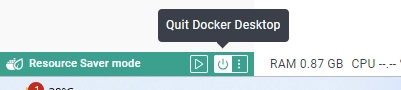

# 環境構築
## Docker Enginの起動、停止
### Docker Enginの起動
画面左下のスタートボタンからスタートメニューを開く -> Docker Desktopをクリック

### Docker Enginの停止
- コマンドプロンプトの終了はDockerの終了ではない
    - [×]でコマンドプロンプトを閉じてもDockerは裏で動いている
    - 停止は以下のボタンを押す

### 自動起動の設定
タスクトレイでDocker Desktop（クジラのマーク）をクリック -> 「Setting」を選択 -> 開いた画面で「General」を選択 -> 「Start Descer Desktop when you log in」にチェックが入っていることを確認（オフにしたい場合は、チェックを外す）