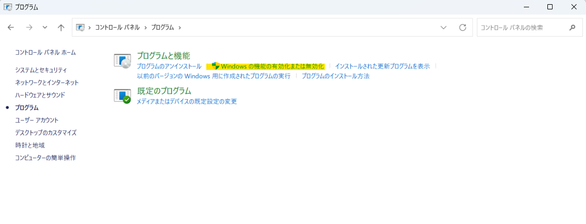
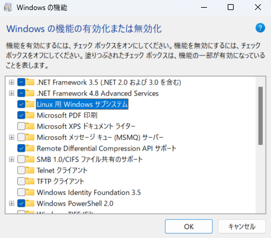
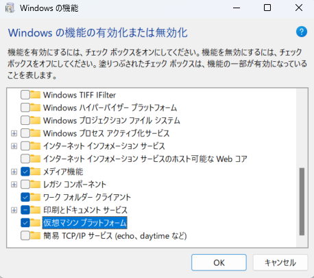

# 環境構築
## デスクトップ版のDockerは普通のソフトウェアのように存在する
仮想化ソフトウェアやLinux OSの存在を意識しなくてよい

まるでWindowsやMacの普通のソフトウェアであるかのように存在して、わざわざ仮想化ソフトウェアを起動して、Linuxを起動して、といったことが不要

## デスクトップ版を使う条件
- Hyper-V（Windowsの仮想環境）をONにする

## インストール手順
1. あああ
    1. [Windows] > [コントロールパネル] > [プログラム] > [プログラムと機能]と開き、[Windowsの機能の有効化または無効化]をクリック
    
        
    2.[Linux用Windowsサブシステム]と[仮想マシンプラットフォーム]を有効化する

        
        

        ※再起動が求められるから再起動する。

2. Linuxカーネルをダウンロードし、アップデートする
    
    [インストーラ（クリックでダウンロード）](https://wslstorestorage.blob.core.windows.net/wslblob/wsl_update_x64.msi)

3. Docker Desktop for Windowsをインストールする。

    [Docker Desktop インストール手順](https://qiita.com/R_R/items/a09fab09ce9fa9e905c5)

4. Docker Desktop for Windowsを起動する

    起動できればOK