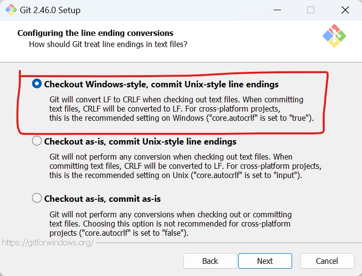
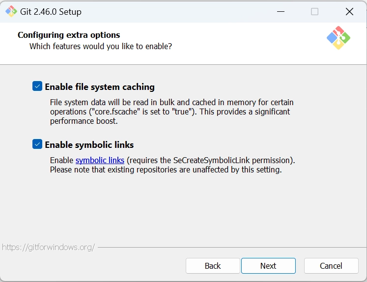

# 環境構築
## Gitのインストール
インストール時の注意点のみ記載

「Configuring the line ending conversions」にチェックを入れる。

チェックアウト時にLFをCRLFにして、プッシュ時にCRLFをLFにしてくれる


両方チェックを入れる



## TortoiseGitのインストール

[TortoiseGitインストール手順＜Windows向け＞](https://sukkiri.jp/technologies/devtools/git/tortoisegit_win.html)

## GitHubへの接続設定
1. ユーザー名とメールアドレスを設定する
    
    ```powershell
    C:\Users\hirok> git config --global user.name "dhirose"
    C:\Users\hirok> git config --global user.email "************@gmail.com"
    C:\Users\hirok> git config --list
    diff.astextplain.textconv=astextplain
    filter.lfs.clean=git-lfs clean -- %f
    filter.lfs.smudge=git-lfs smudge -- %f
    filter.lfs.process=git-lfs filter-process
    filter.lfs.required=true
    http.sslbackend=openssl
    http.sslcainfo=C:/Program Files/Git/mingw64/etc/ssl/certs/ca-bundle.crt
    core.autocrlf=true
    core.fscache=true
    core.symlinks=true
    pull.rebase=false
    credential.helper=manager
    credential.https://dev.azure.com.usehttppath=true
    init.defaultbranch=master
    user.name=dhirose
    user.email=************@gmail.com
    difftool.sourcetree.cmd='C:/Program Files/WinMerge/WinMergeU.exe' "$LOCAL" "$REMOTE"
    mergetool.sourcetree.cmd=''
    mergetool.sourcetree.trustexitcode=true
    core.editor="C:\Users\hirok\AppData\Local\Programs\Microsoft VS Code\bin\code" --wait
    C:\Users\hirok>
    ```
    
    ※設定は.gitconfigファイルに書かれる
    
    ```powershell
    C:\Users\hirok> Get-Content ~/.gitconfig
    [user]
            name = dhirose
            email = hiroki.940920@gmail.com
    [difftool "sourcetree"]
            cmd = 'C:/Program Files/WinMerge/WinMergeU.exe' \"$LOCAL\" \"$REMOTE\"
    [mergetool "sourcetree"]
            cmd = "'' "
            trustExitCode = true
    [core]
            editor = \"C:\\Users\\hirok\\AppData\\Local\\Programs\\Microsoft VS Code\\bin\\code\" --wait
    C:\Users\hirok>
    ```
    
2. 認証設定をする
    1. sshで接続する場合
        1. 参考サイト
            1. [【入門】Githubにsshで接続する手順・注意点まとめ](https://www.kagoya.jp/howto/it-glossary/develop/github_ssh/)
    2. Personal access tokens(アクセストークン)で接続する場合
        1. 参考サイト
            1. [GithubでPersonal access tokens(アクセストークン)を設定してみた](https://dev.classmethod.jp/articles/github-personal-access-tokens/)
            2. [Githubでアクセストークンを使う](https://rfs.jp/server/git/github/personal_access_tokens.html)
    
    sshのほうは毎回パスワードを入力しなくてよいため、アクセストークン方式よりおすすめ

## posh-gitを見やすくする（任意）

以下の手順を行う

[PowerShell Coreのインストール（任意）](../../PowerShell/環境構築/index.md#powershell-core)

[posh-sshモジュールのインストール（任意）](../../PowerShell/環境構築/index.md#posh-ssh)