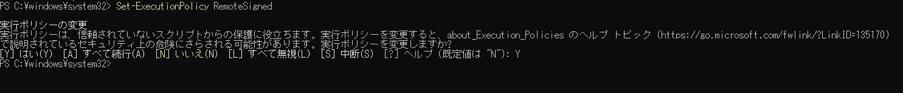
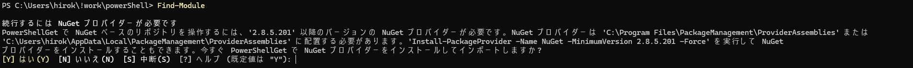
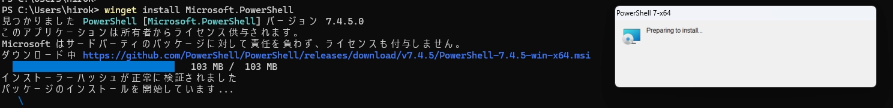
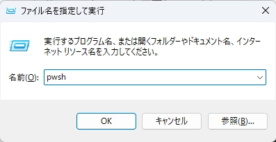
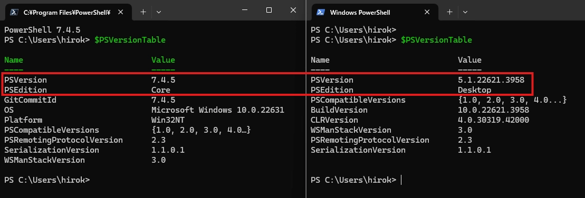
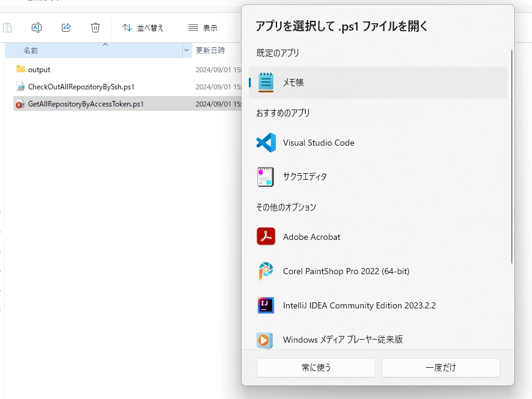
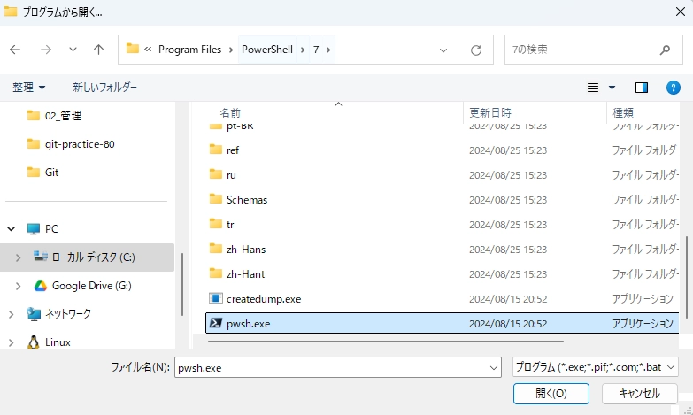
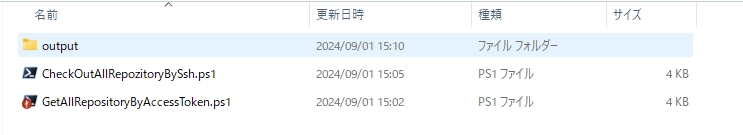

# 環境構築 
## スクリプトを実行できるように設定を変更する
管理者権限でPowerShellを起動して、下記コマンドを実行して、ローカルのスクリプトを署名なしでも実行できるようにする
```PowerShell
# コマンド実行後、ポリシーの変更を求められるから「Y」を押下する。
Set-ExecutionPolicy RemoteSigned
```



## NuGetのインストール（任意）
- Find-Moduleコマンドレットでインストールできる
    - Find-ModuleはPowerShellGyarariyにあるモジュールの一覧を取得する
    - 初回実行だと「NuGet プロバイダー」のインストールが求められるが気にせず「Y」を押下する。

```PowerShell
PS C:\Users\hirok\!work\powerShell> Find-Module

続行するには NuGet プロバイダーが必要です
PowerShellGet で NuGet ベースのリポジトリを操作するには、'2.8.5.201' 以降のバージョンの NuGet プロバイダーが必要です。NuGet プロバイダーは 'C:\Program Files\PackageManagement\ProviderAssemblies' または
'C:\Users\hirok\AppData\Local\PackageManagement\ProviderAssemblies' に配置する必要があります。'Install-PackageProvider -Name NuGet -MinimumVersion 2.8.5.201 -Force' を実行して NuGet
プロバイダーをインストールすることもできます。今すぐ PowerShellGet で NuGet プロバイダーをインストールしてインポートしますか?
[Y] はい(Y)  [N] いいえ(N)  [S] 中断(S)  [?] ヘルプ (既定値は "Y"): Y

Version    Name                                Repository           Description
-------    ----                                ----------           -----------
2.2.1.5    PSWindowsUpdate                     PSGallery            This module contain cmdlets to manage Windows Update Client.
1.0.18     SpeculationControl                  PSGallery            This module provides the ability to query the speculation control settings for the system.
2.8.0      DellBIOSProvider                    PSGallery            The 'Dell Command | PowerShell Provider' provides native configuration capability of Dell Optiplex, Latitude, Precision, XPS Notebook and...
1.4.8.1    PackageManagement                   PSGallery            PackageManagement (a.k.a. OneGet) is a new way to discover and install software packages from around the web....
3.0.3      Az.Accounts                         PSGallery            Microsoft Azure PowerShell - Accounts credential management cmdlets for Azure Resource Manager in Windows PowerShell and PowerShell Core....
2.2.5      PowerShellGet                       PSGallery            PowerShell module with commands for discovering, installing, updating and publishing the PowerShell artifacts like Modules, DSC Resources...
```



## PowerShell Coreのインストール（任意）
PowerShell CoreとWindows PowerShellは共存できるため、PowerShell CoreをインストールしたらWindows PowerShellが使えなくなることはない。  
（Windows PowerShellでもそこそこやれるから、必要になったらインストールでいいかな）

1. wingetコマンドが入っているか確認。  
（デフォルトで入っていたけど、OSによってはデフォルトで入っていない場合もあるかも）
```PowerShell
PS C:\Users\hirok> winget --version
v1.8.1911
PS C:\Users\hirok>
```

2. wingetコマンド初回使用時に同意が求められるため、「Y」で同意する
```PowerShell
PS C:\Users\hirok> winget list # ローカルPC上にインストールされているアプリ一覧取得コマンド
'msstore' ソースでは、使用する前に次の契約を表示する必要があります。
Terms of Transaction: https://aka.ms/microsoft-store-terms-of-transaction
ソースが正常に機能するには、現在のマシンの 2 文字の地理的リージョンをバックエンド サービスに送信する必要があります (例: "US")。

すべてのソース契約条件に同意しますか?
[Y] はい  [N] いいえ: Y
名前                                                           ID                                                                   バージョン       利用可能      ソース
-------------------------------------------------------------------------------------------------------------------------------------------------------------------------
Docker Desktop                                                 Docker.DockerDesktop                                                 4.23.0           4.33.1        winget
Git                                                            Git.Git                                                              2.46.0                         winget
Microsoft Office Home and Business 2021 - ja-jp                ARP\Machine\X64\HomeBusiness2021Retail - ja-jp                       16.0.17830.20166
```

3. ローカルPCにPowerShell Coreがインストールされていないこと確認
```PowerShell
PS C:\Users\hirok> winget list --id Microsoft.PowerShell
入力条件に一致するインストール済みのパッケージが見つかりませんでした。
PS C:\Users\hirok>
```

4. PowerShell Coreをインストールする（最新版がインストールされる）
```PowerShell
PS C:\Users\hirok> winget install Microsoft.PowerShell
見つかりました PowerShell [Microsoft.PowerShell] バージョン 7.4.5.0
このアプリケーションは所有者からライセンス供与されます。
Microsoft はサードパーティのパッケージに対して責任を負わず、ライセンスも付与しません。
ダウンロード中 https://github.com/PowerShell/PowerShell/releases/download/v7.4.5/PowerShell-7.4.5-win-x64.msi
  ██████████████████████████████   103 MB /  103 MB
インストーラーハッシュが正常に検証されました
パッケージのインストールを開始しています...
インストールが完了しました
PS C:\Users\hirok>
```
実行するとインストーラーが立ち上がる

ローカルPCにPowerShell Coreがインストールされたことを確認。
```PowerShell
PS C:\Users\hirok> winget list --id Microsoft.PowerShell
名前             ID                   バージョン ソース
--------------------------------------------------------
PowerShell 7-x64 Microsoft.PowerShell 7.4.5.0    winget
PS C:\Users\hirok>
```

5. PowerShell Coreウィンドウを立ち上げてインストールされたか確認
[Win] + [R]を押下して、「pwsh」と入力し「OK」ボタンを押下してPowerShell Coreウィンドウを立ち上げる
  
バージョンを確認する。
```PowerShell
$PSVersionTable
```
左：PowerShell Core、右：Windows PowerShell


6. スクリプトファイルの関連付け  
      1. 旧Windows PowerShellからPowerShell
        
        
        
      2. 関連付けたらダブルクリックでもスクリプトを実行できるようになる。
7. 参考サイト
    - wingetコマンドを使用したPowerShell Coreのインストール方法
        - [WinGet を使用して PowerShell をインストールする](https://learn.microsoft.com/ja-jp/powershell/scripting/install/install-powershell-on-windows?view=powershell-7.4#winget)
        - [PowerShell を最大限活用するための環境構築](https://qiita.com/asakuramken/items/7cde3ff5920419f2d3e4)
            - このサイトわかりやすいかも
    - wingetコマンドの使い方全般
        - [Windowsのパッケージマネージャー wingetについて](https://qiita.com/SAITO_Keita/items/2a69e06ed3fdb83290e7)
        - [Windows: winget: wingetでよく使うであろうコマンド一覧](https://zenn.dev/atsushifx/articles/winget-help-commands)
## posh-gitモジュールのインストール（任意）
1. モジュールがインストールされていないことを確認
```PowerShell
PS C:\Users\hirok> Get-InstalledModule posh-git
Get-Package: No match was found for the specified search criteria and module names 'posh-git'.
```

2. モジュールをインストール
```PowerShell
PS C:\Users\hirok> Install-Module posh-git -Scope CurrentUser -Force
```
「-Scope CurrentUser」は現在のユーザー、「-Force」は警告を無視してインストールする。
現在のユーザーであれば、管理者で実行しなくてもイ
ンストールできる。

3. モジュールがインストールされたことを確認
```PowerShell
PS C:\Users\hirok> Get-InstalledModule posh-git

Version              Name                                Repository           Description
-------              ----                                ----------           -----------
1.1.0                posh-git                            PSGallery            Provides prompt with Git status summary information and tab completion for Git commands, parameters, remotes and branch names.

PS C:\Users\hirok>
```

4. プロファイルを作成する
```PowerShell
PS C:\Users\hirok\!work\Git\Tool\PowerShell> $PROFILE
C:\Users\hirok\OneDrive\ドキュメント\PowerShell\Microsoft.PowerShell_profile.ps1
```

5. 「4」で作成したプロファイルに以下のコードを追加して、PowerShellを再起動する
```PowerShell
Import-Module posh-git
```

参考サイト  
[Posh-Gitを使ってPowerShellでGit操作を効率化する](https://zenn.dev/torakm/articles/8a52dcc49a5845)


## posh-sshモジュールのインストール（任意）
1. モジュールがインストールされていないことを確認。
    
    ```powershell
    PS C:\Users\hirok> Get-InstalledModule posh-ssh
    Get-Package: No match was found for the specified search criteria and module names 'posh-git'.
    ```
    
    ```powershell
    C:\Users\hirok> Install-Module posh-ssh -Scope CurrentUser -Force
    ```
    
2. モジュールをインストール
「-Scope CurrentUser」は現在のユーザー、「-Force」は警告を無視してインストールする。
現在のユーザーであれば、管理者で実行しなくてもインストールできる。
3. モジュールがインストールされたことを確認。
    
    ```powershell
    C:\Users\hirok> Get-InstalledModule posh-ssh
    
    Version              Name                                Repository           Description
    -------              ----                                ----------           -----------
    3.2.4                Posh-SSH                            PSGallery            Provide SSH and SCP functionality for ex…
    
    C:\Users\hirok>
    ```
    
4. プロファイルを作成する

    ```powershell
    PS C:\Users\hirok\!work\Git\Tool\PowerShell> $PROFILE
    C:\Users\hirok\OneDrive\ドキュメント\PowerShell\Microsoft.PowerShell_profile.ps1
    ```
    
5. 「4」で作成したプロファイルに以下のコードを追加して、PowerShellを再起動する
    
    ```powershell
    Import-Module posh-ssh
    ```
    

参考サイト  
[Posh-Gitを使ってPowerShellでGit操作を効率化する](https://zenn.dev/torakm/articles/8a52dcc49a5845)