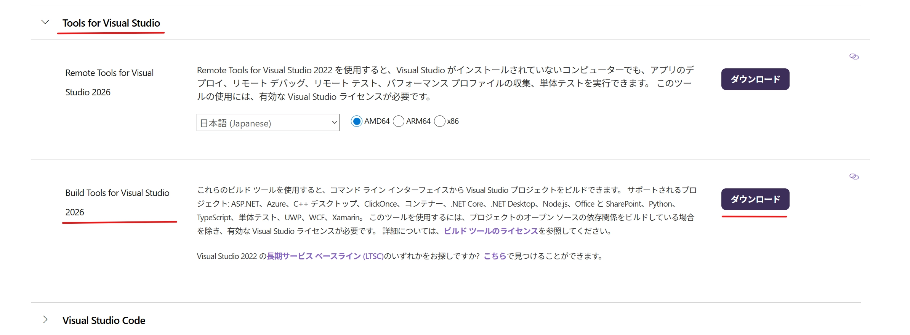
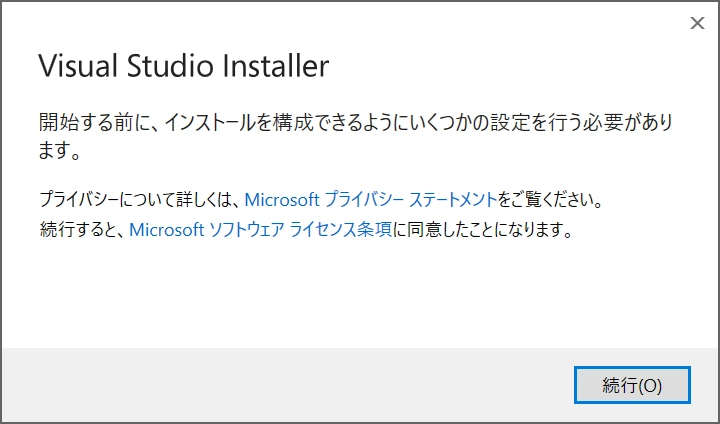
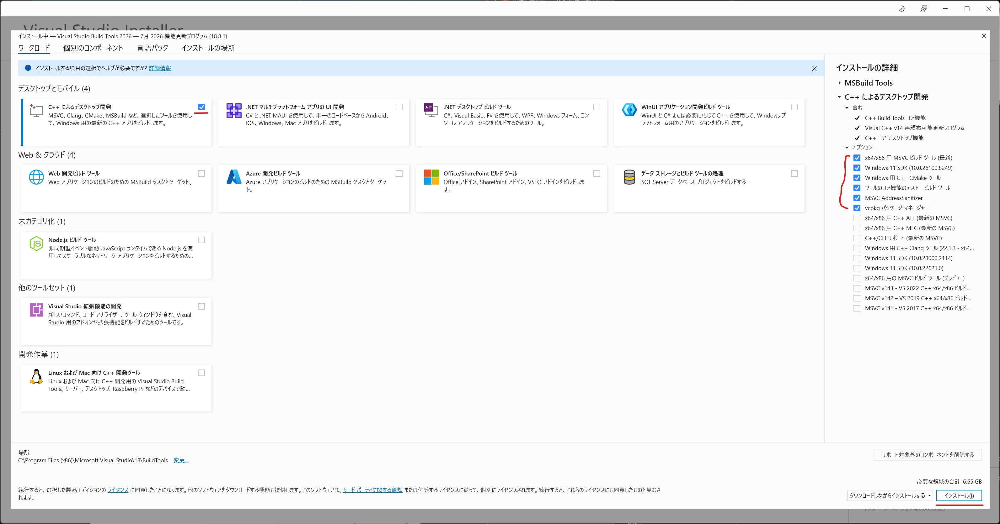
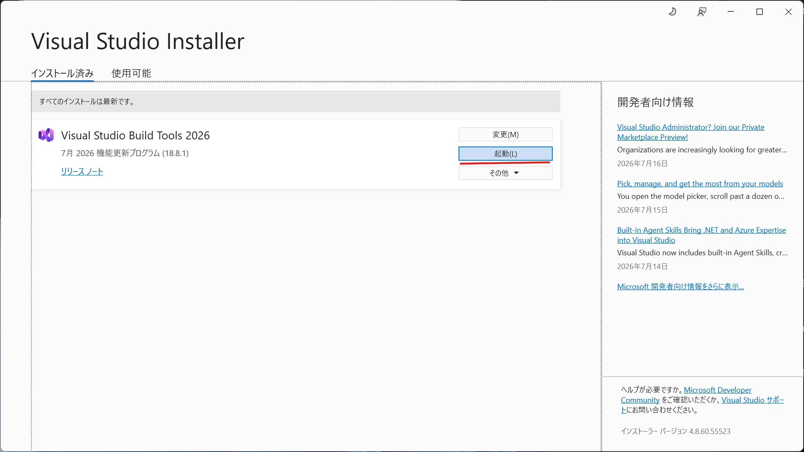
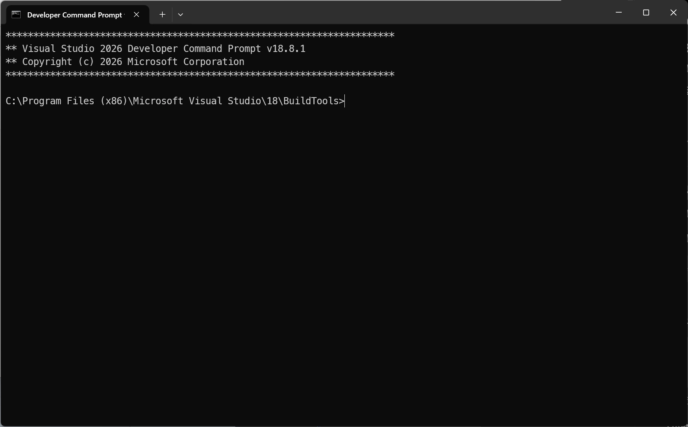
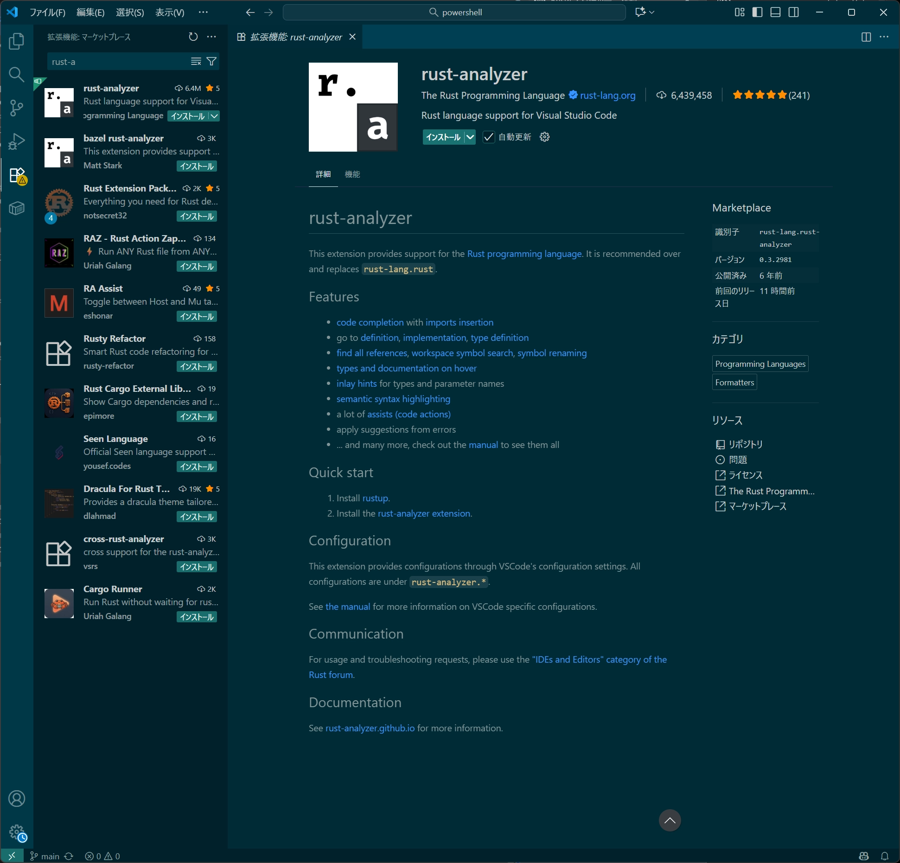
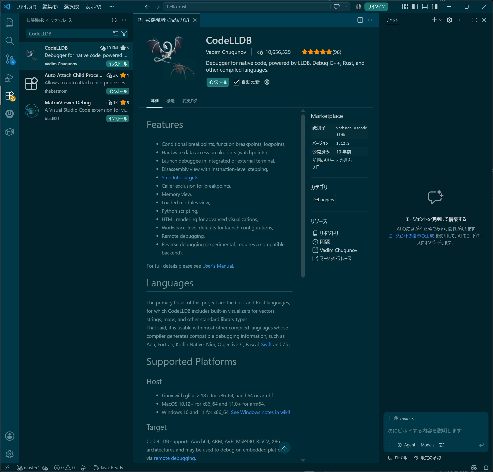

# ローカル環境構築
## VS Code + rust-analyzer
こちらが一番利用者が多い構成。

- 無料
- 軽い
- 拡張機能が豊富
- Microsoft公式のサポートも充実

Rustコミュニティでも非常に人気がある。

### Build Toolsをダウンロード

[Microsoft公式サイト](https://visualstudio.microsoft.com/ja/downloads/?utm_source=chatgpt.com)から **Build Tools for Visual Studio** をダウンロードする。

ページを少し下へスクロールすると**Visual Studio Build Tools**があるから、それをダウンロードする。


vs_BuildTools.exeを起動して、Visual Studio Installerをインストールする




以下プロンプトが立ち上がれば、完了


!image.png

### Rustのインストール

1. https://rustup.rs/ にアクセスし表示して、手順通りインストールする
2. rustup-init.exeを実行
    
    ```powershell
    warn: It looks like you have an existing rustup settings file at:
    warn: C:\Users\hirok\.rustup\settings.toml
    warn: Rustup will install the default toolchain as specified in the settings file,
    warn: instead of the one inferred from the default host triple.

    Welcome to Rust!

    This will download and install the official compiler for the Rust
    programming language, and its package manager, Cargo.

    Rustup metadata and toolchains will be installed into the Rustup
    home directory, located at:

    C:\Users\hirok\.rustup

    This can be modified with the RUSTUP_HOME environment variable.

    The Cargo home directory is located at:

    C:\Users\hirok\.cargo

    This can be modified with the CARGO_HOME environment variable.

    The cargo, rustc, rustup and other commands will be added to
    Cargo's bin directory, located at:

    C:\Users\hirok\.cargo\bin

    This path will then be added to your PATH environment variable by
    modifying the PATH registry key at HKEY_CURRENT_USER\Environment.

    You can uninstall at any time with rustup self uninstall and
    these changes will be reverted.

    Current installation options:

    default host triple: x86_64-pc-windows-msvc
        default toolchain: stable (default)
                profile: default
    modify PATH variable: yes

    1) Proceed with standard installation (default - just press enter)
    2) Customize installation
    3) Cancel installation
    >
    ```
    
    <details>
    <summary>ワーニングメッセージの補足</summary>
        
        以下のメッセージが
        
        ```powershell
        warn: It looks like you have an existing rustup settings file at:
        warn: C:\Users\hirok\.rustup\settings.toml
        ```
        
        これは、すでにrustupの設定ファイルがあるよるようで、以前Rustをインストールしたことがあるか、途中までインストールした痕跡があるだけなので、基本的には気にしなくて大丈夫。
        
        - 過去にRustをインストールしたことがある
        - インストールを途中で中断したことがある
        - 一度アンインストールしたが設定ファイルだけ残っている
        
        ```powershell
        warn: Rustup will install the default toolchain as specified in the settings file,
        ```
        
        Rustupは、この設定ファイルに書かれているデフォルトのツールチェーン（Rustのバージョンなど）を使ってインストールします。
        
        ```powershell
        warn: instead of the one inferred from the default host triple.
        ```
        
        あなたのPCから自動判定した設定ではなく、設定ファイルに保存されている内容を優先します。
        
        ---
        
        **初めてRustをインストールするつもり**で、過去の設定を引き継ぐ必要がないなら、**削除しても問題ない。**
        
        逆に、以前Rustを使っていて設定を残したいなら、削除する必要はない。
        
        ### 判断の目安
        
        - **初めてインストールする・以前の設定は不要**
            - ✅ `C:\Users\hirok\.rustup` フォルダごと削除してOK
            - （`settings.toml`だけでなく関連ファイルも消えます）
        - **以前使っていた環境を引き継ぎたい**
            - ✅ 削除しなくてOK
        
        手動で.rustupを消してexeを再実行したら、同じ警告メッセージが出てきた。
        どうやらexeを実行したら、自動でsettings.tomlができるみたい。
    </details>
     
1. エンターキーを押す  
   1) Proceed with standard installation (default - just press enter)を選択する

2. 以下のメッセージが出たら成功（enterを押下で閉じる）
    
    ```powershell
    1) Proceed with standard installation (default - just press enter)
    2) Customize installation
    3) Cancel installation
    >
    
    info: profile set to default
    info: default host triple is x86_64-pc-windows-msvc
    info: syncing channel updates for stable-x86_64-pc-windows-msvc
    info: latest update on 2026-07-16 for version 1.97.1 (8bab26f4f 2026-07-14)
    info: downloading 6 components
            cargo installed                        9.71 MiB
           clippy installed                        4.04 MiB
        rust-docs installed                       22.76 MiB
         rust-std installed                       21.56 MiB
            rustc installed                       69.04 MiB
          rustfmt installed                        2.46 MiB                                                                                                                                                                                                                       info: default toolchain set to stable-x86_64-pc-windows-msvc
    
      stable-x86_64-pc-windows-msvc installed - rustc 1.97.1 (8bab26f4f 2026-07-14)
    
    Rust is installed now. Great!
    
    To get started you may need to restart your current shell.
    This would reload its PATH environment variable to include
    Cargo's bin directory (%USERPROFILE%\.cargo\bin).
    
    Press the Enter key to continue.
    
    ```
    
3. PowerShellを立ち上げて、以下のコマンドを実行できれば成功
    
    ```powershell
    C:\Users\hirok> rustc --version
    rustc 1.97.1 (8bab26f4f 2026-07-14)
    C:\Users\hirok> cargo --version
    cargo 1.97.1 (c980f4866 2026-06-30)
    C:\Users\hirok>
    ```
    

## VS Codeの設定

### VS CodeでRustを使えるようにする

rust-analyzerを拡張機能をインストールする

以下の便利な機能が使えるようになる。

- コード補完
- エラー表示
- ジャンプ
- リファクタリング



プロジェクトを作成して、動作確認する。Hello, world!が表示されれば成功

```powershell
C:\Users\hirok\work> cargo new hello_rust
    Creating binary (application) `hello_rust` package
note: see more `Cargo.toml` keys and their definitions at https://doc.rust-lang.org/cargo/reference/manifest.html
C:\Users\hirok\work> cd hello_rust
C:\Users\hirok\work\hello_rust [master +3 ~0 -0 !]> cargo run
   Compiling hello_rust v0.1.0 (C:\Users\hirok\work\hello_rust)
    Finished `dev` profile [unoptimized + debuginfo] target(s) in 1.09s
     Running `target\debug\hello_rust.exe`
Hello, world!
C:\Users\hirok\work\hello_rust [master +4 ~0 -0 !]> 
```

### デバッガの拡張機能をインストールする

CodeLLDBをインストールする



### 保存時に自動フォーマット

VS Codeを立ち上げ、Ctrl+Shift+Pを押下して、検索欄に**Preferences: Open User Settings (JSON)**を入力する。

設定ファイルに以下のJSONを追加して、保存する。

```json
{
    "[rust]": {
        "editor.defaultFormatter": "rust-lang.rust-analyzer",
        "editor.formatOnSave": true
    }
}
```