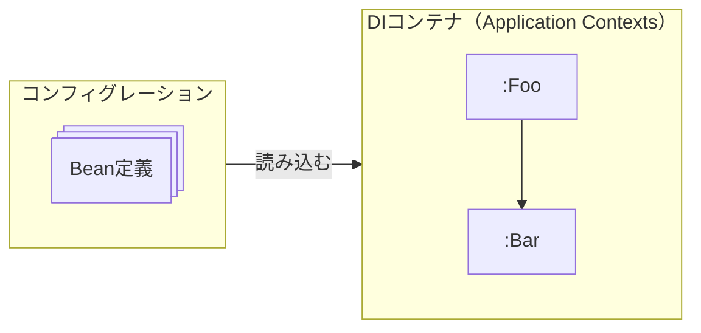

---
tags:
- SpringBoot
- DIコンテナ
---

# DIコンテナ
## DIコンテナとは
依存性の注入を一元管理している入れ物。

※Springの公式マニュアルでは「IoCコンテナ」という名称。
## DIコンテナ関連の基本用語
- Bean
> DIコンテナが管理しているオブジェクトのこと。  
> ※**Java Beans**とは全く関係ない。Spring独自の用語。

- Bean定義
> Beanを定義する情報。  
> 管理させたいオブジェクトの具象クラスは何か、どのオブジェクトをDIするかなどの情報。

- コンフィグレーション
> DIコンテナに読み込ませる情報。  
> Bean定義やDIコンテナの特定の様々な機能群の設定情報を記載する。

- Application Context
> DIの別名。
> DIコンテナに該当するオブジェクトがApplicationContextというインターフェースを実装していることもあり、DIコンテナのことをApplicationContextと呼ぶことがある。




## コンフィグレーションの記述とJavaConfig
**JavaConfig**

> コンフィグレーションを記載するためのクラス。

任意のクラスを作成して**@Configuration**を付ければ、SpringはJavaConfigとして扱う。

```java
@Configuration
public class FooConfig {
    ...
}
```

## Bean定義の3つの手段
- ステレオタイプアノテーション
> Beanとして管理してほしい具象クラスにつけるアノテーション。  
> ステレオタイプアノテーションが付いた具象クラスはDIコンテナによって検知され、自動的にインスタンスが生成されDIコンテナで管理される。

- @Beanアノテーション（メソッド）
> @Beanを付けたメソッド。  
> JavaConfigクラスの中で開発者が@Beanを付与したメソッドを作成して、DIコンテナに管理してほしいオブジェクトを戻り値で返すことによってDIコンテナで管理される。

- <bean>タグ（XMLファイル）
> XMLファイルにBeanとして管理ほしい具象クラスをbeanタグのclass属性に指定することによりDIコンテナで管理される。

```java title="ステレオタイプアノテーション"
@Service
public class FooConfig {}
```
```java title="@Beanアノテーション（メソッド）"
@Service
public FooService fooService() {
    return new FooService();
}
```
```xml title="<bean>タグ（XMLファイル）"
<bean class="com.example.foo.service.FooService"></bean>
```
