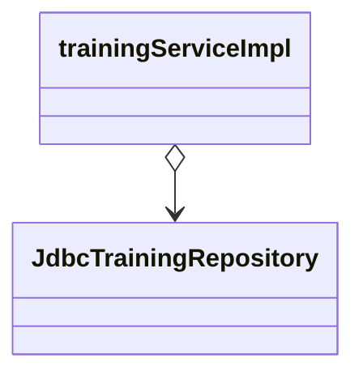

---
tags:
- SpringBoot
- コンフィグレーション
---

# JavaConfigと@Beanメソッド
## 複数のJavaConfigクラスを読み込む方法
### AnnotationConfigApplicationContextクラスのコンストラクタ引数に複数のJavaConfigを指定する

```java
@Configuration
public class FooConfig {}
```
```java
@Configuration
public class BarConfig {}
```
```java
ApplicationContext context = new AnnotationConfigApplicationContext(
    FooConfig.class,
    BarConfig.class
);
```

### @Importでインポートする
@Importアノテーションを使って、あるJavaConfigから別のJavaConfigをインポートする。  
JavaConfigを数珠繋ぎで読み込むイメージ

```java
@Configuration
@Import(BarConfig.class)
public class FooConfig {}
```
```java
@Configuration
public class BarConfig {}
```
```java
ApplicationContext context = new AnnotationConfigApplicationContext(FooConfig.class);
```

### コンポーネントスキャンする
@Configurationは、実はステレオタイプアノテーションの1つ。@Serviceや@Repositoryと同じく、コンポートねとスキャンされるとJavaConfigクラスのオブジェクトが生成されBeanとして管理される。  
その際、JavaConfigクラスであることを認知されて、記載されているコンフィグレーションが読み込まれる。

```java
package foo;

@Configuration
@ComponentScan
public class FooConfig {}
```
```java
package foo;

@Configuration
public class BarConfig {}
```
```java
ApplicationContext context = new AnnotationConfigApplicationContext(FooConfig.class);
```

FooConfigクラス、BarConfigクラスはともにfooパッケージに属していて、@ComponentScanが付与されたFooconfigをAnnotationConfigApplicationContextのコンストラクタに指定する。

すると、fooパッケージをベースパッケージとしてコンポーネントスキャンが行われ、FooConfig、BarConfigの両方が読み込まれる。

この方法の利点は、JavaConfigが増えて行っても楽。  
コンポーネントスキャンされるパッケージ配下にJavaConfigクラスを作成するだけでよい。  
作成したJavaConfigクラスを都度どこかで指定する必要もなく設定漏れのミスがなくなる。

## @Beanメソッドとは
Bean定義するための方法の一つ。  
JavaConfigクラス中に、@Beanを付けたメソッドを作成する。  
※「@Beanメソッド」という呼び名があるわけでなく、便宣上、そう書いている。

```java
@Configuration
public class FooConfig {
    @Bean
    public FooService fooService() {
        return new FooService()
    }
}
```

- @Beanメソッドは、DIコンテナが自動的に呼び出してくれて、返したオブジェクトがBeanとして管理される。
- 1つのJavaConfigクラスの中に複数定義することが可能

```java
@Configuration
public class TrainingApplication {

    @Bean
    public TrainingService trainingService() {
        return new TrainingServiceImpl();
    }

    @Bean
    public TrainingRepository trainingRepository() {
        return new JdbcTrainingRepository();
    }
}
```

## インジェクションの方法

```java
@Configuration
public class TrainingApplication {

    @Bean
    public TrainingService trainingService(TrainingRepository trainingRepository) {
        TrainingServiceImpl trainingServiceImpl = new TrainingServiceImpl(trainingRepository)
        return new trainingServiceImpl;
    }

    @Bean
    public TrainingRepository trainingRepository(TrainingRepository trainingRepository) {
        return new JdbcTrainingRepository();
    }
}
```



このようなtrainingServiceImplに渡さなければいけないTrainingRepositoryの依存性も@Beanメソッドで定義して、それをtrainingServiceImplの生成時に渡すことができる。

@Beanメソッドが呼び出される順番は、DIコンテナが適切に決めてくれる。

## JavaConfigとプロファイル
JavaConfigクラスにプロファイルを割り当ててグルーピングすることが可能。  
@Profileを記述するとJavaConfigクラスに記述したコンフィグレーションの全てが指定したプロファイルに属するようになる。

```java
@Profile("foo")
@Configuration
@ComponentScan
public class FooConfig {
    @Bean
    public FooService fooService() {}
}
```

メソッドに記述した場合は、指定したメソッドのみにプロファイルが適用される。

```java
@Configuration
@ComponentScan
public class FooConfig {
    @Bean
    @Profile("foo")
    public FooService fooService() {}
}
```