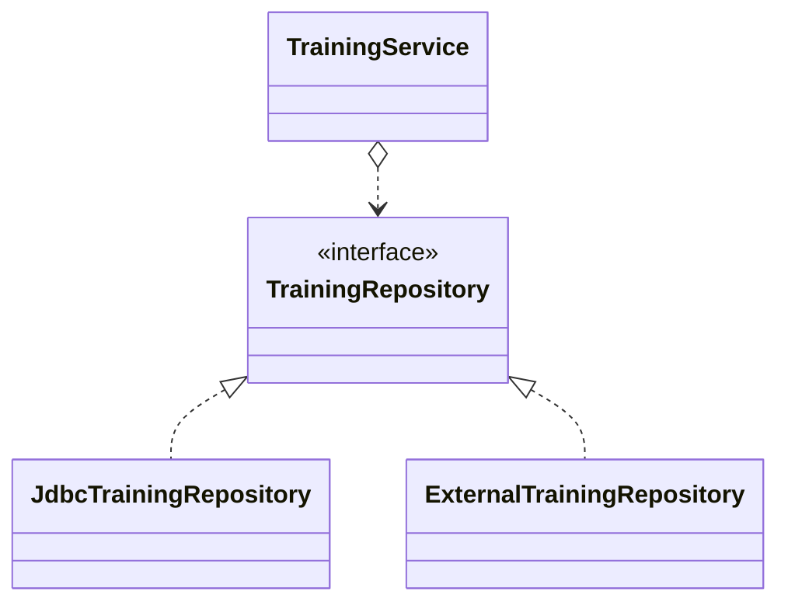

---
tags:
- SpringBoot
- コンフィグレーション
---

# コンフィグレーションの切り替え
## プロファイルとは
コンフィグレーションをグルーピングすることができるDIコンテナの機能。

本番環境用、ステージング環境用とコンフィグレーションを分けてグループ化できる。

どのプロファイルにも属していないBeanは有効化扱いされる。

## プロファイルの使用方法

**@Profile** アノテーションを付与することによって、プロファイルの設定を行うことができる。

以下例は、ServiceクラスがRepositoryクラスを環境によって使い分ける例。  
Serviceクラスは@Profileアノテーションを付けていないため、常に有効になる。

```java title=""
@Service
public class TrainingServiceImpl implements TrainingService { ... }
```

```java title="ステージング環境用のプロファイル設定"
@Repository
@Profile("staging")
public class JdbcTrainingRepository implements TrainingRepository { ... }
```

```java title="本番環境用のプロファイル設定"
@Repository
@Profile("production")
public class ExternalTrainingRepository implements TrainingRepository { ... }
```



## 有効にするプロファイルの指定
代表的なプロファイルの有効化方法の手段は、システムプロパティもしくは環境変数に指定する方法がある。

### システムプロパティでの指定
javaコマンドで`-Dspring.profiles.active`を指定する。
```powershell title="有効にするプロパティをjavaコマンドで指定"
java -Dspring.profiles.active=プロファイル名 mainメソッドを持つクラス名
```

`-Dspring.profiles.active`はDIコンテナが自動的に読み込むプロパティ。  
プロファイル名はカンマ区切りで複数指定が可能。

### 環境変数での指定
OSの環境変数を利用する場合は、環境変数名に`SPRING_PROFILES_ACTIVE`でプロパティ名を指定して、その後にjavaコマンドでアプリケーションを起動する。

=== "Windows OS"
    ``` powershell title="環境変数で有効にするプロファイルを指定"
    export SPRING_PROFILES_ACTIVE=プロファイル名
    java mainメソッドを持つクラス名
    ```
=== "Linux系OS"
    ``` powershell title="環境変数で有効にするプロファイルを指定"
    set SPRING_PROFILES_ACTIVE=プロファイル名
    java mainメソッドを持つクラス名
    ```
