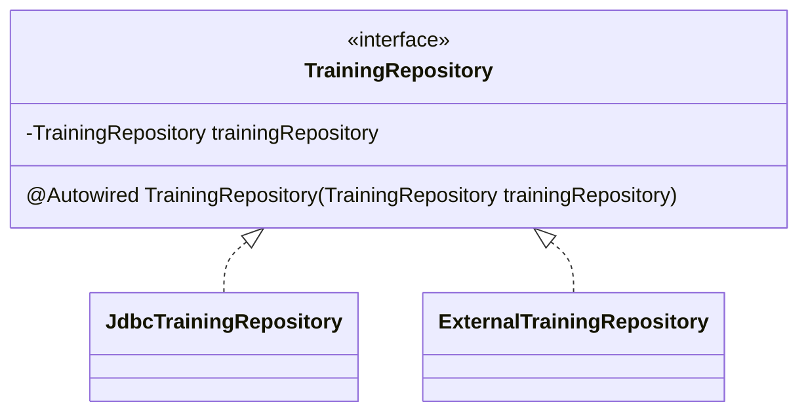

---
tags:
- SpringBoot
- ステレオタイプアノテーション
---

# ステレオタイプアノテーション
## ステレオタイプアノテーション
Beanとして管理したい具象クラスに付与するアノテーション。

## ステレオタイプアノテーションの種類
複数あり、具象クラスの役割に応じて使い分ける。  
Beanとして管理するだけでなく、付加機能を付けてくれるものもある。

|ステレオタイプアノテーション|説明|付加機能|
|-|-|-|
|@Service|Serviceの具象クラスにつける。|なし|
|@Repository|Repositoryの具象クラスにつける。|DBアクセス周りの例外をSpringが提供する例外に変換可能にする|
|@Controller|Controllerの具象クラスにつける。|Spring MVCの機能を利用できるようになる|
|@Component|役割を表さない汎用的なステレオアノテーション。|なし|

## インジェクションの方法
**<mark>@Autowired</mark>** アノテーションを付けることにより、インジェクションされる

```java title="コンストラクタによるインジェクション"
@Service
public class TrainingServiceImpl implements TrainingService {

    private final TrainingRepository trainingRepository;

    @Autowired
    public TrainingServiceImpl(TrainingRepository trainingRepository) {
        this.trainingRepository = trainingRepository;
    }

    @Override
    public List<Training> findAll() {
        return trainingRepository.selectAll();
    }

}
```

※なお、コンストラクタが1つしかない場合は @Autowired アノテーションを省略できる。

## コンポーネントスキャン
### コンポーネントスキャンとは
DIコンテナがステレオタイプアノテーションが付いた具象クラスを探すことをコンポーネントスキャンという。  
コンポーネントスキャンを実行するには、コンフィグレーションを有効にする必要がある。

### コンポーネントスキャンを有効化
コンポーネントスキャンを実行するには、JavaConfigクラス@ComponentScanを付ける。

@ComponentScanを付けたクラスが所属するパッケージを起点にして、サブパッケージを含めて、ステレオタイプアノテーションが付いた具象クラスをDIコンテナが探してくれる。

コンポーネントスキャンの起点となるパッケージのことを、ベースパッケージと呼ぶ。  
ベースパッケージは、明示的に指定することも可能。

`@ComponentScan("com.example.training")`

## DIコンテナの生成とBeanの取得
DIコンテナの生成方法は、複数あるが **AnnotationConfigApplicationContext** を使ったやり方がある。

`ApplicationContext context = new AnnotationConfigApplicationContext(JavaConfigクラス名.class);`


AnnotationConfigApplicationContextのコンストラクタの処理では、JavaConfigクラスに記載されたコンフィグレーションを読み込み、コンポーネントスキャンを行い、見つけたbeanをDIコンテナのオブジェクトが格納する。この時、@Autowiredが指定されていれば、インジェクションも行われる。

```java
@Configuration
@ComponentScan
public class TrainingApplication {

    public static void main(String[] args) {
        ApplicationContext context = new AnnotationConfigApplicationContext(TrainingApplication.class);
    }

}
```

DIコンテナからBeanを取得する際は、DIコンテナが提供するgetBeanメソッドを使うと取得できる。  
引数にはClassオブジェクトを渡す。
```java
public class TrainingApplication {

    public static void main(String[] args) {
        ApplicationContext context = new AnnotationConfigApplicationContext(TrainingApplication.class);
        TrainingService trainingService = context.getBean(TrainingService.class);

        List<Training> trainings = trainingService.findAll();
        for (Training training : trainings) System.out.println(training.getTitle());
    }
}
```

## インジェクションの種類

- コンストラクタインジェクション

```java
@Service
public class TrainingServiceImpl implements TrainingService {

    private final TrainingRepository trainingRepository;

    @Autowired
    public TrainingServiceImpl(TrainingRepository trainingRepository) {
        this.trainingRepository = trainingRepository;
    }

}

```
※ コンストラクタが1つしかない場合は、@Autowiredを省略可能

- Setterインジェクション

```java
@Service
public class TrainingServiceImpl implements TrainingService {

    private TrainingRepository trainingRepository;

    @Autowired
    public void setTrainingServiceImpl(TrainingRepository trainingRepository) {
        this.trainingRepository = trainingRepository;
    }

}
```

- フィールドインジェクション

```java
@Service
public class TrainingServiceImpl implements TrainingService {

    @Autowired
    private TrainingRepository trainingRepository;

}
```


一般的に推奨されるのはコンストラクタインジェクション。  
フィールドにfinal修飾子を付けられるなどの理由がある。

## 同じ型のBeanが複数存在した場合のインジェクションの挙動



同じ型のBeanが2以上あり@Autowiredして使う場合に、DIコンテナはどちらをインジェクションすればいいのか分からないため、エラーが発生する。

これを回避するには、以下の目的によって対処方法が変わってくる。

- 稼働中に2つのオブジェクトの処理を呼び分けたいのか
> BeanにIDを割り振って、インジェクションする側が使いたいBeanをのIDを指定してインジェクションする
- 実行（起動）するタイミング（本番環境で実行する、ステージング環境で実行する、など）でどちらか一方で切替えたいのか
> コンフィグレーションを使ってインジェクションする

