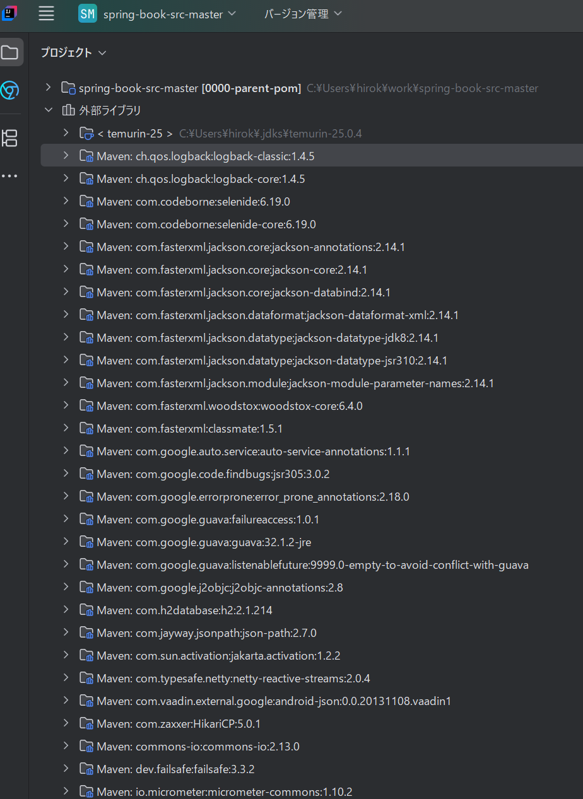

---
tags:
- SpringBoot
- SpringBootによる生産性の向上
---

# SpringBootによる生産性の向上
SpringBootは、SpringFrameworkが登場してから約10年後の2024年に登場したプロジェクト。
本章ではSpringBootの機能を取り扱う。
- ライブラリ一括取得
- オートコンフィグレーション
- 組み込みAPサーバ

## ライブラリの一括取得
アプリケーション開発で使われる様々なライブラリは、ひとつひとつのライブラリを設定ファイルに指定したり、ライブラリ間の相性のいいバージョンを調査するのが大変。  
SpringBootは、数多くのライブラリを指定済みのpom.xmlを提供する。

それを使うには、Maven Central Repositoryに登録されている、Startesのアーティファクトをpom.xmlに記述する。
```xml title="pom.xmlのサンプル"
    <parent>  <!-- ② -->
        <groupId>org.springframework.boot</groupId>
        <artifactId>spring-boot-starter-parent</artifactId>  <!-- ① -->
        <version>3.0.1</version>  <!-- ③ -->
    </parent>
    ...
    <dependencies>
        <dependency>  <!-- ⑤ -->
            <groupId>org.springframework.boot</groupId>
            <artifactId>spring-boot-starter</artifactId>  <!-- ④ -->
        </dependency>
        ...
    <dependencies>
```

- ①
> 「spring-boot-starter-parent」はStartersのアーティファクトの1つ。
- ②
> 「spring-boot-starter-parent」を指定することで、この情報が開発者が用意するpom.xmlに引き継がれる。
- ③
> 「spring-boot-starter-parent」のバージョン。SpringBootのバージョンを指定する意味合いになる。
- ④
> 「spring-boot-starter」を指定。
- ⑤
> dependencyタグを指定することで、spring-boot-starterの多くのライブラリが使えるようになる



spring-boot-starterはSpringを使用するための最小限のStarters。他にも様々なものがある

- spring-boot-starter-jdbc
    - JDBCを使ってDBアクセスするためのライブラリ。DaSource、トランザクション制御、Spring JDBCなどのライブラリが含まれる。
- spring-boot-starter-web
    - ServletのAPIや、Spring MVC、組み込みTomcatなどのライブラリ。
- spring-boot-starter-test
    - JUnitをはじめとするテスト用の様々なライブラリ。

## オートコンフィグレーション
名前の通り自動でコンフィグレーションを行う機能。  
ライブラリが提供する具象クラスのBean定義と、Springが提供する各種機能を有効化を自動的にコンフィグレーションしてくれる。

## オートコンフィグレーションの裏側
SpringBootが提供している作成済みのJavaConfigクラスを読み込んでいるだけ。  
DataSource用のJavaConfig、PlatformTransactionManager用のJavaConfigなどオートコンフィグレーションの内容に応じて様々なJavaConfigが用意されている。

必要なオートコンフィグレーション、不要なオートコンフィグレーションをSpringBootが判断してDIコンテナにBeanとして読み込む、読み込まないをやってくれている。

### オートコンフィグレーションのプロパティ
オートコンフィグレーションのカスタマイズも可能。  
接続情報をpropertiesに記載する例。

```properties title="DBアクセス周りのコンフィグレーションのサンプル"
spring.datasource.url=jdbc:postgresql://db.example.com/training
spring.datasource.username=trainingApp
spring.datasource.password=r#pU=R2B
```

application.yamlでも書くことができる。
```yaml title="DBアクセス周りのコンフィグレーションのサンプル"
spring:
  datasource:
    url: jdbc:postgresql://db.example.com/training
    username: trainingApp
    password: r#pU=R2B
```

## 組み込みAPサーバ
SpringBootはAPサーバをライブラリとして組み込んだ形になる。アプリケーションのプログラムの中からAPサーバが起動される。  
開発者はAPサーバのライブラリを取得した状態でDIコンテナを生成するだけ。あとはSpringBootが自動的にAPサーバを起動してくれる。

## SpringBootを利用する際のDIコンテナの生成方法
SpringBootを利用する際はSpringApplicationクラスのrunメソッドで起動する。
```java
public static void main(String[] args) {
    ApplicationContext context = SpringApplication.run(TrainingApplication.class, args);
    ...
}
```

- 第1引数
    - DIコンテナに読み込ませるJavaConfigクラス
- 第2引数
    - コマンド引数
      - DIコンテナは渡されたコマンドライン引数の情報を内部で保持してくれてるから、必要に応じて参照できる。


AnnotationConfigApplicationContextクラスとの大きな違いは、application.propertiesファイルを読み込む点。

SpringBootの主要機能であるオートコンフィグレーションを有効にするには、 **@EnableAutoConfiguration** というアノテーションをJavaConfigにつける必要がある
```java title="SpringBootを利用する際のDIコンテナの生成"
@Configuration
@ComponentScan
@EnableAutoConfiguration
public class TrainingApplication {
    public static void main(String[] args) {
        ApplicationContext context = SpringApplication.run(TrainingApplication.class, args);
        ReservationService reservationService = context.getBean(ReservationService.class);
        ...
        reservationService.reserve(reservationInput);
    }
}
```

SpringBootではこのような、mainメソッドの中でmainメソッドを定義しているクラス自身をDIコンテナに読み込ませる慣例が多い。  
またSpringBootでは@Configuration、@ComponentScan、@EnableAutoConfigurationの3つのアノテーションを含んだ **@SpringBootApplication** アノテーションが提供されている。

```java title="@SpringBootApplicationを利用"
@SpringBootApplication
public class TrainingApplication {
    public static void main(String[] args) {
        ApplicationContext context = SpringApplication.run(TrainingApplication.class, args);
        ReservationService reservationService = context.getBean(ReservationService.class);
        ...
        reservationService.reserve(reservationInput);
    }
}
```

## SpringBootで誤解されがちなこと
SpringBootを使うと、ライブラリの取得やコンフィグレーション、APサーバの準備が簡単にできてすぐに動かせるが、アプリケーション固有の処理クラス（Controller、Service、repositoryなど）を簡単に作成できるわけではない。