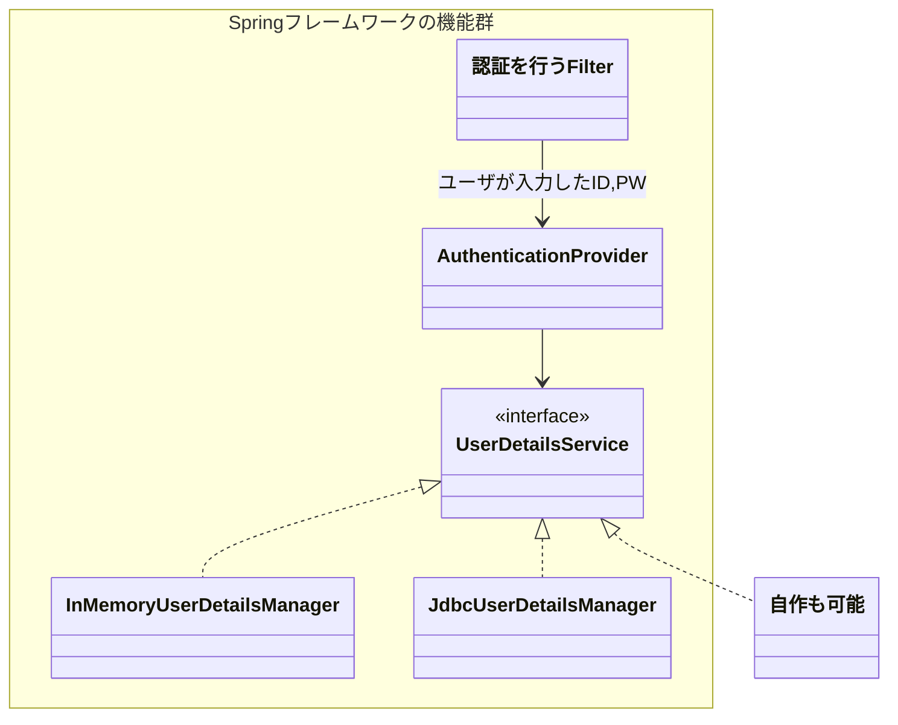

---
tags:
- SpringBoot
- Restful
---

# 14_Spring Securityを用いた認証と認可
## 認証と認可
### 認証（Authentication）
認証とはアプリケーションを使用する相手を特定する行為。

相手のことを **Principal（主体）** という。

### 認可(Authorization)
認可とは認証した相手がアクセスするリソース（データや操作）に対して、アクセスの許可を制御する行為。

相手が持っている権限と、リソースに設定されている条件を比較し、アクセスの許可を判断する。

権限のことをAuthorityと呼ぶ。また、Role（役割）と言ったりもする。

## Spring Securityの認証の概要
Spring Securityは様々な認証手段をサポートしている

- ログイン画面でで認証するForm認証
- HTTP標準のBasic認証
- シングルサインオンが可能なOAuth2.0

また、認証時に必要なID・パスワードといったデータをサーバ側で格納する場所も様々な場所をサポートしている

- DB
- メモリ
- LDAP

## Spring Securityの認可の概要
代表的な3種類の認可がある。

- リクエストの認可
> ブラウザからのリクエストに対してアクセスの可否を判断する  
> 例えばブラウザからアクセスした「/admin/update」に対して、ログイン中のユーザーが管理者権限を持っていればアクセス可能、持っていなければアクセス不可とするような処理を行う。

- メソッドの認可
> 呼び出されるメソッドに対して、呼び出し可能か判断する。  
> 例えば、ある業務ロジックが呼び出されるタイミングで、ログイン中のユーザーが管理者権限を持っていなければアクセス不可とする。

- 画面表示の認可
> 画面の中の特定の箇所をログイン中のユーザーの権限に応じて、表示したり日表示したりする判断をする。  
> 例えば、管理者だけ見えるべき情報を、管理者がログインしている時だけ表示する。

## Spring SecurityのFilter
Spring SecurityはServlet Filterの仕組みを使って様々な処理を挟み込む。  
Spring MVCでは裏ではDispatcherServletと呼ばれるServletが動いているため、DispatcherServletオブジェクトに処理が行き着く前にServlet Filterを使って処理が挟み込まれることになる。
[Servletのフィルタとは](https://www.javadrive.jp/servlet/filter/index1.html)

Spring SecurityのFilterは役割ごとに複数のFilterから構成される。このFilterのつながりのことをSpring Chain Filterと呼ぶ。

**代表的なFilter**

- 認証を行うFilter
> ID・パスワードが送信されてきたらサーバ側で保持している認証情報と比較する。

- リクエストの許可を行うFilter
> リクエストに対して、ユーザーの権限が満たされているかをチェックする。権限が満たさない場合は例外をスローする。

- 例外をハンドリングするFilter
> 未認証や例外エラーを表す例外がスローされたら、ログイン画面や権限エラー画面に遷移させる。

## Spring Filter Chainのコンフィグレーション
Spring Securityを使用する際はSecurity Filter Chainをコンフィグレーションする必要がある。
Security Filter Chainをコンフィグレーションは、JavaConfigクラスで行うことができる。
``` java
@Configuration
@EnableWebSecurity
public class SecurityConfig {

}
```

@Configuration、@EnableWebSecurityを付けることにより、デフォルトのSecurity Filter Chainが用意されてログイン画面も提供される。

アプリケーション要件に応じて独自のコンフィグレーションを行う場合は@Beanメソッドを定義して、Spring Filter ChainのオブジェクトとしてBean定義する。

**アプリケーション固有のコンフィグレーションの例**

- リクエストの認可
> 例えば、/adminで始まるパスは、ADMIN権限のユーザでなければアクセスできないといった設定を行う。

- ログイン画面
> ログイン画面（開発者が作成）をSpring Securityに表示してもらうため、ログイン画面のパスの設定などを行う。

- 認可NGのときの画面
> ユーザの権限が満たない場合に遷移させる画面のパスなどを設定する。

- 認証時に使用するデータ（ID・パスワードなど）の格納場所
> DBやメモリなど様々な格納場所から選択し設定する。

## リクエストの認可
リクエストの認可のコンフィグレーションのSecurityFilterChainの@Beanを
``` java title="リクエストの認可のコンフィグレーション"
@Configuration
@EnableWebSecurity
public class SecurityConfig {

    @Bean
    public SecurityFilterChain securityFilterChain(HttpSecurity http) throws Exception {
        http
            .authorizeHttpRequests()
            .requestMatchers(HttpMethod.POST, "/admin/**").hasRole("ADMIN")
            .requestMatchers("/admin/**").hasAnyRole("ADMIN", "STAFF")
            .anyRequest().permitAll();

        return http.build();
    }

}
```

- HttpSecurityオブジェクトは自動的にコンテナに登録されるため、@Beanメソッドの引数で受け取ることができる。
- HttpSecurityオブジェクトはSecurityFilterChainオブジェクトを生成するにあたって、様々な設定をメソッドチェーンで指定できる。
- リクエストの認可の設定は、authorizeHttpRequestsメソッドで取得したオブジェクトに対してrequestMatchersメソッドでパスやHTTPメソッドを設定する。
- hasRoleメソッドはアクセス可能な権限を設定する。
- `requestMatchers(HttpMethod.POST, "/admin/**").hasRole("ADMIN")`
    - /POSTメソッドのリクエストで、パスが「admin」で始まるものに対して権限の設定を行っている
    - 「**」はワイルドカードを表していて複数のサブパスを含んだ任意のパスを表す。
        - 例えば「/admin/abc」、「/admin/abc/def」、「/admin」などの場合に合致する。
    - 「*」の場合は、1つのサブパスに限定した任意のパスを表す。
        - 例えば「/admin/*」と指定した場合、「/admin/abc」には合致するが、「/admin/abc/def」や「/admin」には合致しなくなる。
    - hasRoleはrequestMatchersメソッドで指定したパスに対してアクセス可能な条件を指定する。「ADMIN」という権限をユーザーが持っている場合だけアクセスを許可する。
- `requestMatchers("/admin/**").hasAnyRole("ADMIN", "STAFF")`
    - HTTPメソッドを指定していなく、POST以外の「/admin/**」へのリクエストに対する設定。
    - hasAnyRoleメソッドで「ADMIN」もしくは「STAFF」の権限であればアクセスを許可する。
- `.anyRequest().permitAll()`
    - anyRequestメソッドは、全てのリクエストを表す。上のrequestMatchersで設定した以外のリクエストを表す。
    - permitAllメソッドは、無条件でアクセスを許可する指定。クライアントがログインしていなくてもアクセスが許可される。

**アクセス可能な条件を指定する主なメソッド**

|メソッド名|アクセス可能な条件|使用例|
|-|-|-|
|hasRole|指定した権限（ロール）をユーザーが持っている|hasRole("ADMIN")|
|hasAnyRole|指定したいずれかの権限（ロール）をユーザーが持っている|hasAnyRole("ADMIN", "STAFF")|
|hasAuthority|指定した怪訝をユーザが持っている。hasRoleと使い方は似ているが、権限の名前がロール（役割）ではない場合（例えば、特定の操作など）は、こちらを使用するとよい|hasAuthority("READ")|
|hasAnyAuthority|指定したいずれかの権限をユーザが持っている|hasAnyAuthority("READ","WRITE")|
|permitAll|無条件でアクセス可能|permitAll()|
|denyAll|無条件でアクセス不可|denyAll()|
|isAuthenticated|認証されている（権限問わない）|isAuthenticated()|
|isAnonymous|認証されていない（認証されていたらアクセス不可）|isAnonymous()|


注意点として、複数のrequestMatchersメソッド記述する場合は、上から順にチェックが行われ、リクエストがマッチした時点でアクセスのOK・NGが判断され残りのチェックは実施されない。

## ログイン画面
Spring Securityで未認証のユーザがアクセスしてきた際に、ログイン画面に遷移させることが可能。

``` java title="ログイン画面の設定"
@Configuration
@EnableWebSecurity
public class SecurityConfig {

    @Bean
    public SecurityFilterChain securityFilterChain(HttpSecurity http) throws Exception {
        http
            .authorizeHttpRequests()
            .requestMatchers(HttpMethod.POST, "/admin/**").hasRole("ADMIN")
            .requestMatchers("/admin/**").hasAnyRole("ADMIN","STAFF")
            .anyRequest().permitAll()
        .and()
            .formLogin()
            .loginPage("/login")
            .failureUrl("/login?failuer")
            .defaultSuccessUrl("/admin/training/display-list");
        return http.build();
    }
}
```

- formLoginメソッドはログイン画面を設定するメソッド
- loginPageメソッドはログイン画面を表示する際のパスを指定する
    - これにより未認証のユーザーからリクエストが飛んできたら、自動的にGETで`/login`に遷移させる。
    - ログイン画面を表示するハンドラは、自分で用意する。
    - Spring Securityはデフォルトだと、ログイン画面を表示する際にPOSTリクエストを送信すると、ログインのリクエストと認識して認証の処理を実行する。
- failureUrlメソッドはログインに失敗した時に遷移させる画面のパスを指定する
- defaultSuccessUrlメソッドはログインが成功した時に遷移させるデフォルトの画面のパスを指定する


``` java title="ログイン画面を表示するハンドラメソッド"
@Controller
public class AuthPageController {
    @GetMapping("/login")
    public String loginForm() {
        return "auth/loginForm";
    }

    @GetMapping(value="/login", params="failure")
    public String loginFail(Model model) {
        model.addAttribute("failureMessage", "ログインに失敗思案した");
        return "auth/loginForm";
    }
}
```
``` html title="ログイン画面のテンプレートファイル"
<body>
<div th:if="${failureMessage != null}" th:text="${failureMessage}"></div>
<form th:action="@{/login}" method="post">
  <table>
    <tr>
      <th>ID</th>
      <td><input type="text" name="username"/></td>
    </tr>
    <tr>
      <th>PASSWORD</th>
      <td><input type="password" name="password"/></td>
    </tr>
  </table>
  <input type="submit" value="ログイン"/>
</form>
</body>
```

## 認可に失敗したときのエラー画面
認可に失敗したときのエラー画面も開発者が用意することができる
``` java title="認可に失敗したときのエラー画面の設定"
    @Bean
    public SecurityFilterChain securityFilterChain(HttpSecurity http) throws Exception {
        ...
            .failureUrl("/login?failuer")
            .defaultSuccessUrl("/admin/training/display-list");
        .and()
            .exceptionHandling()
            .accessDeniedPage("/display-access-denied");
        return http.build();
    }
```

- exceptionHandlingメソッドは、認証や認可時に例外が発生した時のハンドリングを設定するメソッド
- accessDeniedPageメソッドは認可に失敗し例外が発生した時に、指定したパスに遷移させるための設定

``` java title="アクセスエラー画面を表示するハンドラ"
@Controller
public class AuthPageController {
    ...
    @RequestMapping(/display-access-denied)
    public String accessDenied() {
        return "auth/accessDenied";
    }
}
```

- 認可のエラー画面の場合は、GETとPOSTの両方が想定されるためRequestMappingを使用する
- Spring Sequrityはログイン画面に遷移させる際はリダイレクトを使う。リダイレクト先へのリクエストは必ずGETのリクエストになるため、ログイン画面を表示するハンドラメソッドは@GetMappingを使用する。これに対し、認可に失敗した時のエラー画面に遷移させる際は、フォワードを使っている。フォワードの場合、サーバ内で閥のパスに遷移させるため、元々のリクエストがGETの場合は遷移先のハンドラはGETを付ける必要がある。POSTの場合はハンドラメソッドはPOSTで受け付ける必要がある。GETとPOSTの両方を受け付けられるようにするため、@RequestMappingを使用する必要がある。

``` html title="アクセスエラー画面のテンプレートファイル"
<body>
    <h1>アクセス不可</h1>
    <span>アクセスできません</span>
    <a href="javascript:history.back()">戻る</a>
</body>
```

## 認証用のデータの取得
ID・PWを使った認証を行う場合は、以下の処理を行う

1. AuthenticationProviderがユーザが入力したID,PWの検証を行う。
       1. 認証を行う際のID,PW,権限でーたをUserDetailsServiceから取得する。
2. UserDetailsServiceはID,PW,権限でーたをUserDetailsオブジェクトに格納して戻り値としてAuthenticationProviderに返却する。
       1. UserDetailsServiceのオブジェクトはBeanに登録することができる。
       2. InMemoryUserDetailsManager、JdbcUserDetailsManagerがある。
          1. InMemoryUserDetailsManagerは基本的にはテスト用や検証用に使う用途が多い。



```java title="InMemoryUserDetailsManagerクラスのBean定義"
@Configuration
@EnableWebSecurity
public class SecurityConfig {
    @Bean
    public UserDetailsService userDetailsService() {
        UserDetails taro = User.builder()
            .username("taro").password("{noop}taro123").roles("MANAGER").build();
        UserDetails jiro = User.builder()
            .username("jiro").password("{noop}jiro").roles("EMPLOYEE").build();
        UserDetails saburo = User.builder()
            .username("saburo").password("{noop}saburo123").roles("GUEST").build();
        return new InMemoryUserDetailsNanager(taro, jiro, saburo);
    }
}
```

- UserDetailsオブジェクトは、Userクラスのbuilderメソッドを呼んでメソッドチェーンで作ることができる。
- `{noop}`はパスワードを暗号化したとこのアルゴリズムのIDを表す。
    - SpringSecurityは、ユーザが入力したPWとサーバ側で暗号化して保持されたPWを比較する際に{}かっこの中に記載されたアルゴリズムを使用して比較する。
    - noopは「no operation」を意味して、暗号化されていない平文を表す。

## 画面表示の認可
画面表示の認可は、ユーザの権限によって部分的に画面を表示/非表示にする。

```html title="画面表示の認可"
<!DOCTYPE HTML>
<html xmlns:th="http://www.thymeleaf.org" xmlns:sec="http://www.thymeleaf.org/extras/spring-security">
    ...
    <body>
        <div sec:authorize="hasRole('ADMIN')">
            <input type="submit" name="update" value="更新" />
            <input type="submit" name="delete" value="削除" />
        </div>
        <a th:href="@{/maintenance/product/display-list}">一覧に戻る</a>
    </body>
</html>
```

Spring Security用のThymeleafの拡張機能を使用するため、`xmlns:sec="http://www.thymeleaf.org/extras/spring-security"`を指定する。これにより「sec:xxx」で拡張の属性を使える。  
SpEL（Spring Expression Language）は、Spring Frameworkが提供する独自の式。true/falseを返す度k時の関数が用意されている。

|関数名|アクセス可能な条件|使用例|
|-|-|-|
|hasRole|指定した権限（ロール）をユーザーが持っている|hasRole('ADMIN')|
|hasAnyRole|指定したいずれかの権限（ロール）をユーザーが持っている|hasAnyRole('ADMIN', 'STAFF')|
|hasAuthority|指定した権限をユーザーが持っている。hasRoleと使い方は似ているが、権限の名前がロール（役割）ではない場合（例えば、特定の操作など）は、こちらを使用するとよい|hasAuthority('READ')|
|hasAnyAuthority|指定したいずれかの権限をユーザーが持っている|hasAnyAuthority('READ', 'WRITE')|
|permitAll|無条件でアクセス可能|permitAll()|
|denyAll|無条件でアクセス不可|denyAll()|
|isAuthenticated|認証されていない（権限を問わない）|isAuthenticated()|
|isAnonymous|認証されていない|isAnonymous()|

## 認証したユーザーの情報を画面に表示する
認証したユーザーの情報はAuthenticationインターフェースの実装クラスが保持している。  
Authenticationオブジェクトはセッションスコープに格納される。SpringSecurityはリクエストを受け付けた際にセッションスコープにAuthenticationオブジェクトが存在するか否かで認証済みか否か判断している。

Authenticationは代表的なプロパティに、name、authorities、principalがある。  
それぞれユーザーID、権限、UserDetailsオブジェクトが格納されている。

ThymeleafでAuthenticationオブジェクトのデータを画面に表示するには、sec:authentication属性を使用する。
```html title="画面表示の認可"
        <div sec:authorize="isAuthenticated()">
            こんにちは：<span sec:authentication="name"></span>さん
            <form th:action="@{/logout}" method="post">
                <input type="submit" value="ログアウト">
            </form>
        </div>
```

## メソッドの認可
メソッドが呼び出されるタイミングで認可を行うことができる。
メソッドの認可を有効化するには`@EnableMethodSecurity`を使う。

```java title="メソッドの認可を有効化"
@Configuration
@EnableWebSecurity
@EnableMethodSecurity
public class SecurityConfig {...}
```

JavaConfigに`@EnableMethodSecurity`を付けたら、後は認可を行いたいメソッドに対して`@PreAuthorize`を付ける

```java title="メソッドの認可"
@Service
@Transactional
public class TrainingServiceImpl implements TrainingService {
    ...
    @Overrice
    @PreAuthorize("hasRole('ADMIN')")
    public void delete(String trainingId) {
        trainingRepository.delete(trainingId);
    }
}
```

hasRoleはSpELの関数呼び出しの記述。  
ADMIN怪訝を持っていなければ例外を発生させる。  
メソッドの裏側では、Proxyと呼ばれるオブジェクトが自動生成されてProxyオブジェクトの認可処理が挟み込まれている。  
ProxyオブジェクトはTrainingService型のオブジェクトになっているため、呼び出し元がTrainingServiceオブジェクトをインジェクションしようとすると、Proxyオブジェクトがインジェクションされる。

## CSRFの対応
CSRFはCross Site Request Forgeryの意味。  
一般的な対処法として、CSRFトークンと呼ばれる値を使用する。  
CSRFトークンはWEBサイト側で生成するランダムな値で、レスポンス時のhtmlにCSRFトークンを埋め込んで、ユーザーがリクエスト時にそのCSRFトークンを含めてリクエストを送る。  
サーバ側で生成したCSRFトークンと一致していれば処理を継続、していなければエラーにするという手法。

### Spring SecurityによるCSRFの対応
Spring SecurityはデフォルトでCSRFトークンを自動的に生成してセッションスコープに保持する。  
ブラウザはPOSTリクエスト時にhtmlに埋め込まれたCSRFトークンも含めてリクエストする。

CSRFトークンは`th:action`属性を使うと自動的にhtmlに埋め込まれる。
```html title="th:action属性を使用したサンプル"
<h1>研修更新</h1>
<form th:action="@{/admin/training/validata-update-form}" method="post" th:object="${trainingAdminInput}">
```

以下は出力されるhtml
```html title="出力されたHTML"
<h1>研修更新</h1>
<form th:action="/admin/training/validata-update-form" method="post">
    <input type="hidden" nama="_csrf" value="1ac926dd-dd7e-4a29-957c-180f50d34e57">
```
