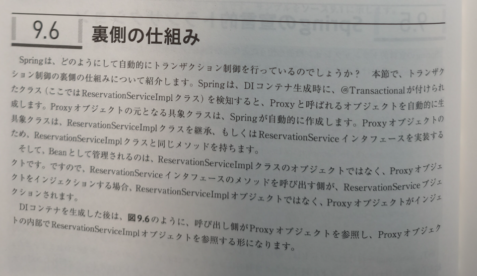
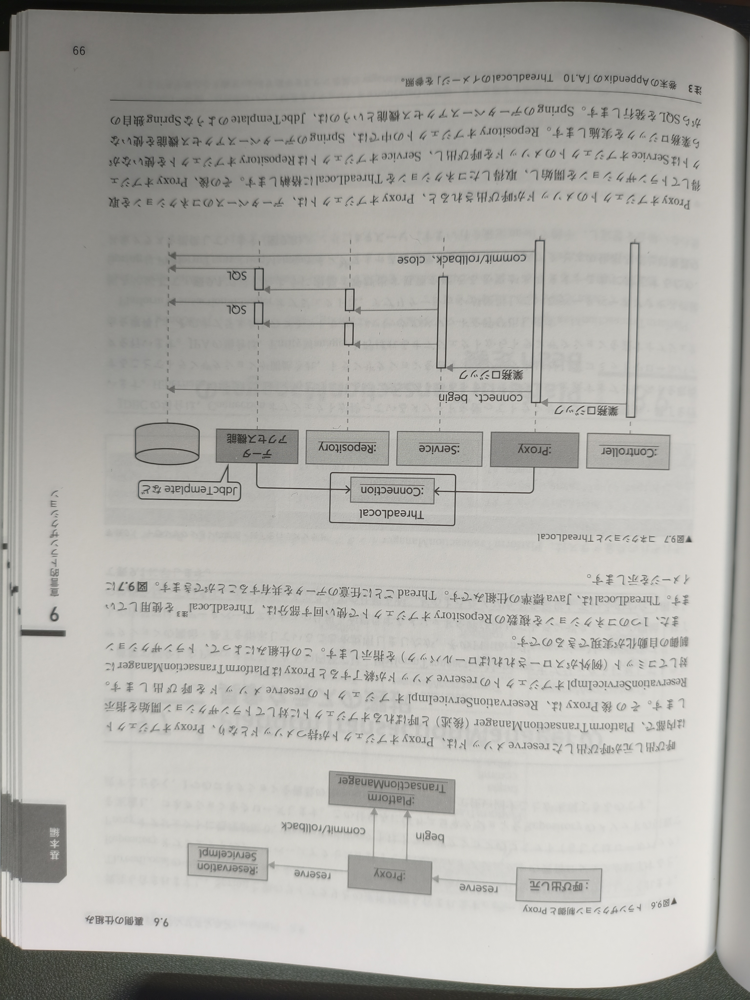
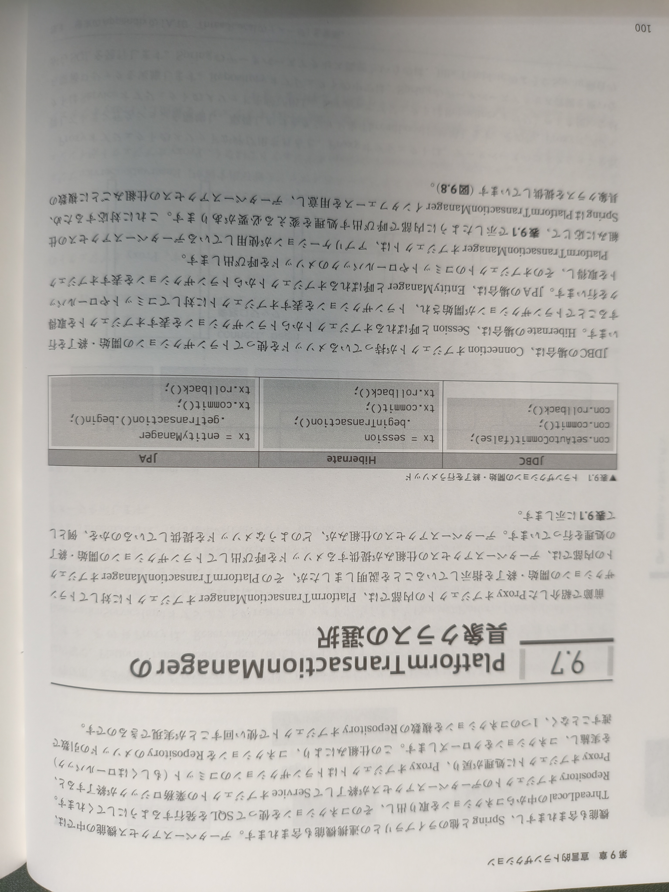
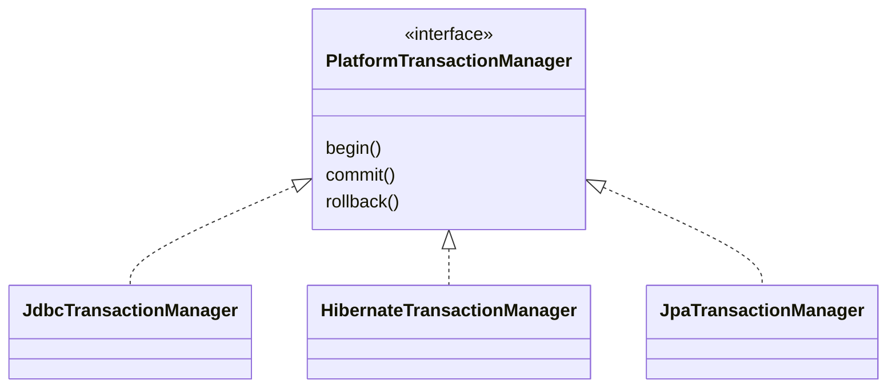

---
tags:
- SpringBoot
- 宣言的トランザクション
---

# 宣言的トランザクション
## トランザクションを自前で制御する場合の問題
複数のRepositoryでトランザクション制御する場合は、1つのコネクションを使いまわす必要がある。  
そうなると、ServiceクラスでConnectionオブジェクトを生成して、各Repositoryのメソッドの引数に渡してあげる必要がある。

その際の問題点として以下の問題点がある。
- 横断的関心事が紛れ込む
  - Connectionオブジェクトの生成とtry-catchによるエラーハンドリング
  - オートコミットのoff
  - コミット、またはロールバック

## Springの宣言的トランザクション
@Transactionalを使うことにより、自動的にトランザクション制御が行われ「トランザクションを自前で制御する場合の問題」は解決できる。

```java
@Transactional
@Override
public Reservation reserve(ReservationInput reservationInput) {
    Training training = trainingRepository.selectById(reservationInput.getTrainingId());
    ...
    trainingRepository.update(training);
    ...
    reservationRepository.insert(reservation);
    return reservation;
}
```

@Transactionalを付けたメソッドは、呼び出されたタイミングでコネクションの取得やトランザクションの開始が自動的に行われ、メソッドが終了すると自動的にコミットやコネクションのクローズが行われる。  
また、例外がスローされた場合には自動的にロールバックされる。

クラスにもアノテーションを付けることができる。

## 裏側の仕組み




## PlatformTransactionManagerの具象クラス
DBアクセスは製品のよって実装が異なる。
```java title="JDBC"
con.setAutoCommit(false);
con.commi();
con.rollback();
```
```java title="Hibernate"
tx = session.beginTransaction();
tx.commit();
tx.rollback();
```
```java title="JPA"
tx = entityManager.getTransaction().begin();
tx.commit();
tx.rollback();
```

PlatformTransactionManagerはDBアクセスの仕組みに応じて内部で呼び出す処理を変える必要があるため、インターフェースを用意してDBアクセスの仕組みごと取り換えられるような作りになっている。


開発者はDBアクセスの仕組みに応じて、適切なPlatformTransactionManagerインターフェースの具象クラスをBean登録すればよい。

## PlatformTransactionManagerのBean定義
PlatformTransactionManagerの具象クラスはSpringが提供している。
```java title="PlatformTransactionManagerのBean定義"
@Bean
public PlatformTransactionManager transactionManager(Datasource dataSource) {
    return new JdbcTransactionManager(dataSource);
}
```

## @Transactionalを有効にするためのコンフィグレーション
@Transactionalが付いたクラスを検知して、Proxyオブジェクトを自動生成してもらうための設定。  
@EnableTransactionManagementをJavaConfigクラスに付ければ、この指示をSpringに出すことができる。
```java title="@Transactionalを有効にするコンフィグレーション"
@Configration
@EnableTransactionManagement
public class FooConfig {
    @Bean public PlatformTransactionManager transactionManager(DataSource dataSource) {
        return new JdbcTransactionManager(dataSource);
    }
}
```

## ログ出力の方法
PratformTransactionManagerの具象クラスはトランザクション開始、コミット、ロールバックするタイミングでログを出力している。  
application.propertiesで設定できる。

```text title="トランザクション制御のログ出力（application.properties）"
logging.level.org.springframework.jdbc.support.JdbcTransactionManager=DEBUG
```

「logging.level」はログレベルの設定を表すプロパティ名の固定の出だし。ロガー名はJdbcTransactionManagerのパッケージ名+クラス名を記述する。

また、設定ファイルを使用せずに、プログラム上でログレベルを設定することも可能。  
（以下はLogbackというライブラリでの例）
```java title="トランザクション制御のログ出力（プログラム上）"
((ch.qos.logback.classic.Logger) LoggerFactory.getLogger(
    "org.springframework.jdbc.support.JdbcTransactionManager")).setLevel(Level.DEBUG));
```
```title="ログ出力例"
17:13:00.756 [main] DEBUG org.springframework.jdbc.support.JdbcTransactionManager - Creating new transaction with name [com.example.training.service.ReservationServiceImpl.reserve]: PROPAGATION_REQUIRED,ISOLATION_DEFAULT
```
