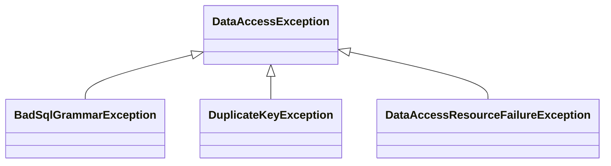

---
tags:
- SpringBoot
---

# データベースアクセス時の例外
DBアクセス時の例外は、使用するDBアクセスの仕組みごとに例外クラスが異なる。  
Sprigはそれらを汎用的な例外クラスに変換してくれる。

## DBアクセスの仕組みと例外
DBアクセスの仕組みとスローする例外

|仕組み|例外|
|-|-|
|JDBC|SQLException|
|MyBatis|(MyBatisの)PersistenceException|
|JPA|(JPAの)PersistenceException|
|Hibernate|HibernateException|

DBアクセスの仕組みに依存したプログラムになるため、DBアクセスの仕組みを変える際にハンドリングしている部分を修正しなければならない。

## 汎用的な例外クラスによる解決
SpringはDBアクセスの仕組みに依存しない汎用的な例外クラスを提供する。  
DBアクセス例外がスローされた場合に汎用的な例外に変換してくれる。

## DataAccessExceptionクラスの代表的なサブクラス。
Springが提供するDB周りの汎用的な例外クラスはDataAccessExceptionクラスを継承している。  
エラー原因事に継承クラスがある。
DataAccessExceptionは非チェック例外。

|例外クラス|原因|
|-|-|
|BadSqlGrammarException|SQLの文法間違い|
|DuplicateKeyException|キーの重複|
|DataAccessResourceFailureException|DBアクセスの失敗|

