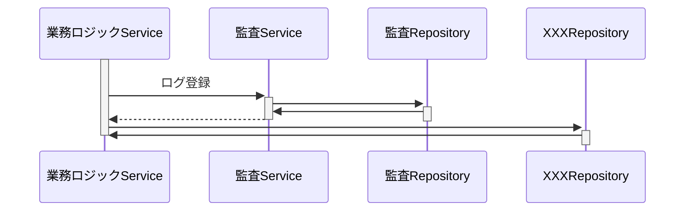
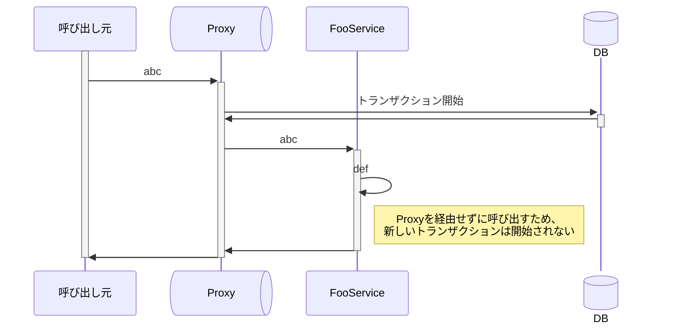

---
tags:
- SpringBoot
---

# トランザクションの伝搬
## トランザクションの伝搬とは
@Transactionalがあるメソッドの中で、さらに@Transactionalのメソッドを呼ぶことをトランザクションの伝搬という。  
トランザクションを伝搬させるか、させないかは選択することができる。
```java title="トランザクションの伝搬"
class FooService {
    @Transactional
    public void foo() {
        barService.bar()
    }
}
class BarService {
    @Transactional
    public void bar() {
        ...
    }
}
```

## トランザクションの伝搬の設定
トランザクションの伝搬の設定は呼び出される側のメソッドにpropagation属性を設定して行う。  
propagationは全部で7種類あるけど、実際の開発で使用されることが多いのは「REQUIRED」と「REQUIRES_NEW」

```java
class BarService {
    @Transactional(propagation=XXX)
    public void bar() {
        ...
    }
}
```

## REQUIRED
REQUIREDはデフォルトの設定。propagation属性を設定しなければREQUIREDが設定される。  
REQUIREDは呼び出し元ですでにトランザクションが開始していれば、呼び出された側も同じトランザクションの中で処理される。
この場合、元々2つのトランザクションが1つとして扱われる。  

## REQUIRES_NEW
呼び出し元ですでにトランザクションが開始されているかどうかにかかわらず、必ず新しいトランザクションを開始する。

## REQUIRES_NEWの利用シーン
監査ログをDB登録する場合、必要になる。　　
監査ログとは、いつ、どのユーザーが、どのような機能を使ったかを記録しておき、システム化適切に利用されているかを評価する際の情報となるログ。


例えば、以下の監査ServiceをREQUIRES_NEWにして、業務ロジックServiceが失敗しても監査ログを記録するようにする。


## REQUIRES_NEWの注意点
トランザクション制御は、Proxyと呼ばれるオブジェクトが行っている。  
FooServiceオブジェクトのメソッドが呼び出される際はProxyオブジェクトが処理を仲介して行う。
しかし、以下のように自分自身が持っているメソッドを呼ぶ場合はProxyオブジェクトを仲介しないため、新しいトランザクションは開始されない。

```java title="トランザクションの伝搬"
class FooService {
    @Transactional
    void abc() {
        barService.bar()
    }
    @Transactional(propagation=REQUIRES_NEW)
    void def() {
        ...
    }
}
```


このような場合は、defメソッドを別のサービスクラスにしてabcメソッドから呼ぶ出すなどのようにすれば解決できる。

Proxyについては[9_宣言的トランザクション](./../../基本/9_宣言的トランザクション/index.md)を参照