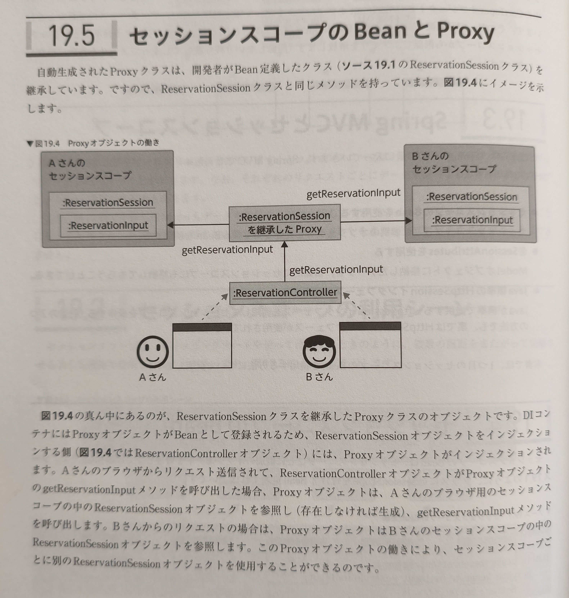

---
tags:
- SpringBoot
---

# セッションスコープ
セッションスコープは、アクセスしているブラウザごとの固有のデータを、リクエストをまたがってサーバ側で保持するためのJava標準の仕組み。

## Spring MVCとセッションスコープ
Spring MVCでセッションスコープを扱う方法は、大きく３種類ある

- セッションスコープのBeanを使用する
    > セッションスコープごとに個別のオブジェクトを管理してくれるBeanを使用する。
- @SessionAttributesを使用する
    > Modelオブジェクトに格納したデータを、自動的にセッションスコープにも格納してもらうことができる。
- Java標準のHttpSessionインターフェースを使用する
    > Javaが標準で提供するHttpSessionインターフェースを使用してセッションスコープを操作する（前述の2つの方法でも、裏ではHttpSessionインターフェースが使用されている）。

本章では、1つ目を説明する。

## セッションスコープのBean
クラスに@SessionScopeを付けてBean定義するだけ。
```java title="セッションスコープのBean定義"
@Component
@SessionScope
public class ReservationSession {
    private ReservationInput reservationInput
    ...
}
```

DIコンテナを生成した際に、裏ではSpringが自動生成したProxyと呼ばれるクラスのオブジェクトがBeanとして登録される。

## セッションスコープのBeanとProxy


Springを理解するのにProxyも重要なキーワード。

## セッションスコープのBeanの実装サンプル
```java title="セッションスコープのBeanの実装サンプル"
@Component
@SessionScope
@suppressWarnings("serial")
public class ReservationSession implements Serializable {
    private ReservationInput reservationInput;
    public ReservationInput getReservationInput() { return reservationInput; }
    public ReservationInput setReservationInput(ReservationInput reservationInput) { return this.reservationInput = reservationInput; }

    public  void clearData() {
        reservationInput = null;
    }
    ...
}
```

- セッションスコープに格納されるオブジェクトは、シリアライゼーションを使用するための記述が必要。
- セッションスコープのデータは、サーバのメモリを消費するため不要になったら破棄する必要がある。clearDataで破棄する。
    - セッションスコープのBeanを使用する場合、ReservationSessionオブジェクト自体を削除することはできないため、フィールドを初期化する。

SerializableやsuppressWarningsについては、[Serializable](./../../../../../Tips/シリアライゼーション/index.md)を参照。

## セッションスコープのBeanのインジェクション
セッションスコープのBeanは他のBeanにインジェクションすることができる。  
インジェクションの仕方は普通にコンストラクタインジェクションなりでできる。
``` java title="セッションスコープのBeanのインジェクション"
@Controller
public class ReservationController {
    private tinal ReservationService reservationService;
    private tinal ReservationSession reservationSession;

    public ReservationController(ReservationService reservationService, ReservationSession reservationSession) {
        this.reservationService = reservationService;
        this.reservationSession = reservationSession;
    }
}
```

**実際にreservationSessionにインジェクションされるのは、ReservationSessionを継承したProxyオブジェクト。**

## セッションスコープのBeanの操作
インジェクションしたセッションスコープのBeanは、任意のタイミングで使っていけばいい。  

## 複数のControllerでセッションスコープのBeanを共有する
セッションスコープのBeanは複数のControllerオブジェクトにインジェクションして使っていくことも可能。  
Proxyオブジェクトが参照するオブジェクトが同じ場合、複数のControllerから同じセッションスコープのBeanを使える。