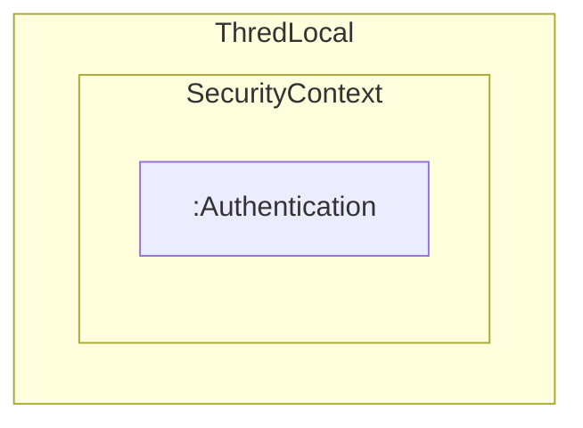

---
tags:
- SpringBoot
---

# Security Contextの活用
Spring Securityは認証したユーザの情報をSecurity Contextと呼ばれる場所に格納する。
Security Contextの知識があるとSpring Securityを使いこなしやすくなる。

## Spring SecurityのFilter
Spring SecurityはJava標準のServlet Filterの仕組みで様々な処理を挟み込んでいる


```mermaid
flowchart
    ブラウザ@{ shape: browser }
    Filter[":Spring SecurityのFilter"]
    style Filter stroke-dasharray: 5 5
    
    ブラウザ --> Filter --> :DispatcherServlet --> :Controller
```

この仕組みを使ったSpring MVCが提供するDispatcherServletオブジェクトの処理の前と後で、様々な処理を挟み込んでいる

## 認証したユーザの情報とSpring Security
認証処理を行ってOKだった場合、ユーザ情報がSecurity Contextと呼ばれる領域に格納される。
Security ContextはSecurity Contextインターフェース型のオブジェクトとして用意される。
Security Contextオブジェクトはセッションスコープに格納される。
認証済みのユーザからのリクエストを受け付けた場合、セッションスコープの中のSecurity Contextオブジェクトを確認し、認証済みかどうかを判断している。

```mermaid
---
title: 認証したユーザの情報とSecurityContextオブジェクト
---
flowchart
    ブラウザ@{ shape: browser }
    subgraph SessionScope
        subgraph SecurityContext
            UserInfo[ユーザー情報]
        end
    end
    Filter[":Spring SecurityのFilter"]
    style Filter stroke-dasharray: 5 5
    
    ブラウザ --> Filter --> :DispatcherServlet --> :Controller
    Filter --> SessionScope
```

SecurityContextオブジェクトの中のユーザ情報はAuthenticationオブジェクトになっていて、代表的なものでは以下のプロパティを持っている。

- name(ユーザID)
- authorities(ユーザの権限)
- principal(ユーザの詳細情報)

## ThredLocalとSecurity Context
Security Contextは[ThredLocal](./../../../../../Tips/ThredLocal/index.md)にも格納されるため、どこからでもユーザ情報にアクセス可能。

ThredLocalのAuthenticationオブジェクトを取得する主なケースとして以下のようなものがある。

- Controllerのハンドラメソッドの引数で受け取る
- HTMLにユーザー情報を埋め込む
- SecurityContextHolder.getContextメソッドでプログラムの任意の箇所で取得する



## Controllerのハンドラメソッドの引数で受け取る
Controllerクラスのハンドラメソッドの引数でAuthentication型引数を定義すると、SecurityContextオブジェクトの中のAuthenticationオブジェクトが引数で渡される。

```java title="Controllerのハンドラメソッドの引数で受け取る"
    @PostMapping(value = "/update", params = "update")
    public String update(
            @Validated TrainingAdminInput trainingAdminInput,
            Authentication authentication) {
        trainingAdminService.update(trainingAdminInput, authentication.getName());
        return "admin/training/updateCompletion";
    }
```

---

Principalオブジェクトを直接ハンドラメソッドの引数で受け取ることもできる。

```java title="ハンドラメソッドの引数でPrincipalのオブジェクトを受け取る。"
    @PostMapping(value = "/update", params = "update")
    public String update(
            @Validated TrainingAdminInput trainingAdminInput,
            @AuthenticationPrincipal UserDetails userDetails) {
        trainingAdminService.update(trainingAdminInput, userDetails.getUsername());
        return "admin/training/updateCompletion";
    }
```

## HTMLにユーザー情報を埋め込む
テンプレートファイルから認証中のユーザ情報を参照することができる。

```html title="ユーザー情報を埋め込む"
<div>こんにちは<span sec:authentication="name"></span>さん</div>
```

sec:authentication属性を使うとAuthenticationオブジェクトを参照できる。  

---

```html title="Principalオブジェクトを参照"
<div>こんにちは<span sec:authentication="principal.username"></span>さん</div>
```

Authenticationオブジェクトのprincipalプロパティを参照して、Principalオブジェクトのusernameプロパティにアクセスしている。

## SecurityContextHolder.getContextメソッドでプログラムの任意の箇所で取得する
SecurityContextHolder.getContextでSecurityContextオブジェクトが取得できる。  
SecurityContextオブジェクトのgetAuthenticationでAuthenticationオブジェクトが取得できる。

```java
    public void registerLog(String  functionName) {
        Authentication authentication = SecurityContextHolder.getContext().getAuthentication();
        ...
    }
```


SecurityContextHolder.getContextはstaticメソッドだからどこからでも呼び出せるが、開発者が任意の場所で自由に呼び出すのは避けたほうが良い。

理由としてテストがやりにくくなる（Spring Securityで事前に認証しないとプログラムを動かせなくなる）などの弊害が出る。

ユーザ情報を取得するための共通部品をBeanとして作成し、その中で使用するとよい（テストの際は共通部品をMockに切り替えるといった対応が可能となるため）