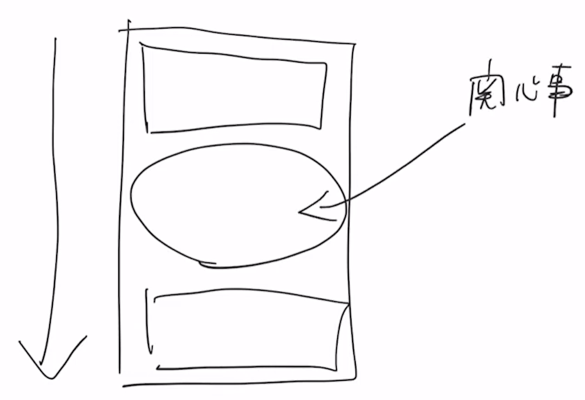
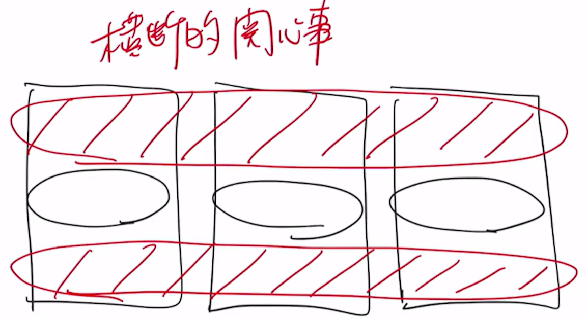
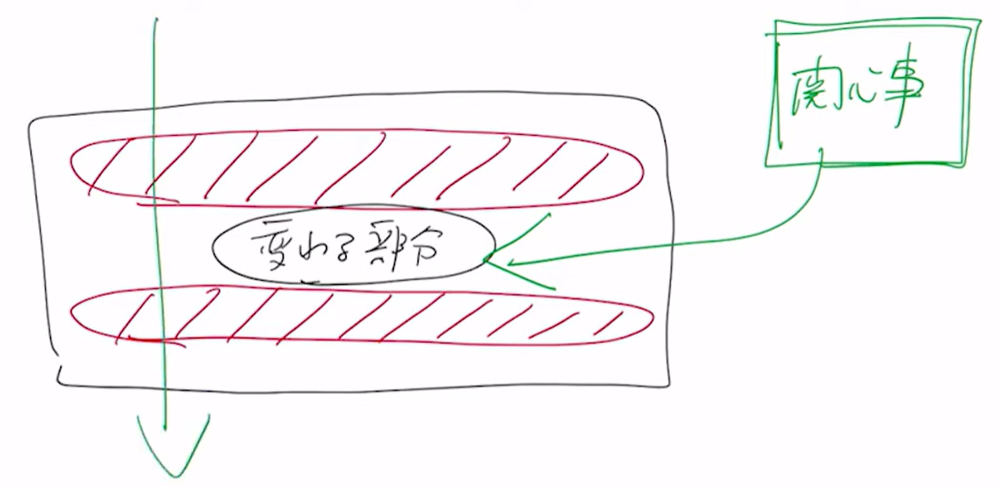

---
tags:
  - プログラミング
  - 設計
  - 関心の分離
---

# 関心の分離
## 導入
### 関心事とは
処理を書く上で、お決まりのコード（事前のコード、事後のコード）とやりたいコードを書く。  
このやりたいコードのことを **関心事** という



### 2種類の関心事
関心事には2種類ある

- それぞれのプログラムのメソッド毎に違いがある関心事
- どうしても事前と事後で入ってくるであろうお決まりのコード
    - ファイルアクセス
    - ログ出力
    - DBアクセス
    - セキュリティチェック
    - 例外処理
    - トリムのクローズ

この共通の関心事のことを **横断的関心事** という


### 関心事の分離
横断的関心事を実装した1つのプログラムに、関心事を後から入れてあげられるようにする。



### 実装例
```text title="パッケージ構成"
src
│  ItemTest.java
│  Main.java
│
└─sample
        Factory.java
        Item.java
        Sample.java
        Test.java
```

```java title="デフォルトパッケージ"
import sample.Test;

public class Main {
    public static void main(String[] args) {
        Test test = new Test();
        test.process(() -> System.out.println("Hello with Lambda."));
    }
}
```
```java title="sampleパッケージ"
package sample;

public class Test {
    public void process(Sample sample) {
        System.out.println("start");  // 横断的関心事
        sample.execute();
        System.out.println("end");  // 横断的関心事
    }
}
```
```java title="sampleパッケージ"
package sample;

@FunctionalInterface
public interface Sample {
    void execute();
}
```