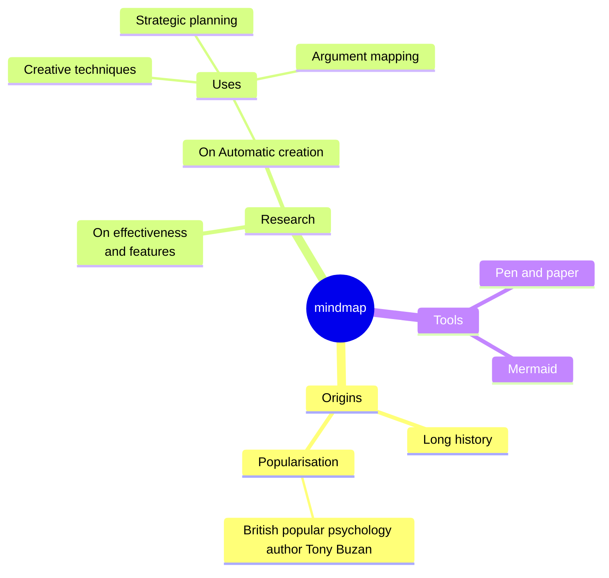
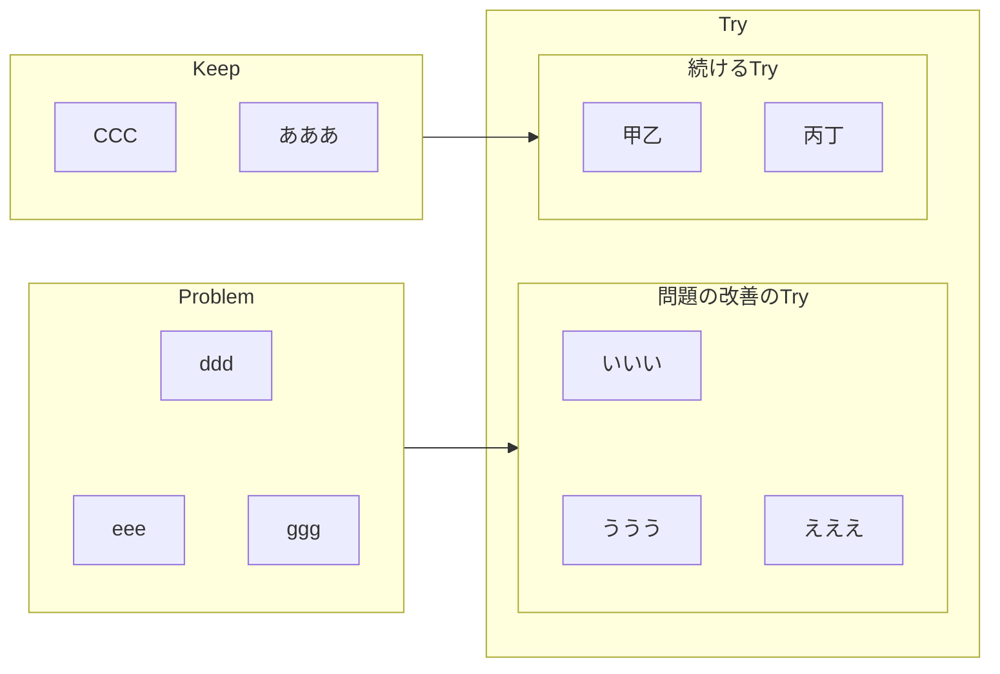

# 設計

## 最低限の基本的な検討するべき設計

### 共通
  - プリミティブ型執着をやめる
### クラス
  - 値オブジェクト（カプセル化、不変）
  - staticメソッドの使いどころをちゅいする（横断的関心事）

### コンストラクタ
  - 完全コンストラクタ（生焼けオブジェクト、不正値の混入を弾く）
  - 生成ロジックをカプセル化する（Factory）

### メソッド・関数
  - 出力引数を避ける（副作用）
  - デメテルの法則を守る（尋ねるな命じろ）

### 変数・引数
  - 再代入しない、させない（final）

