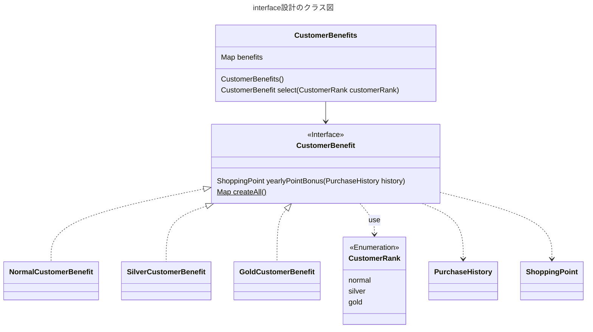
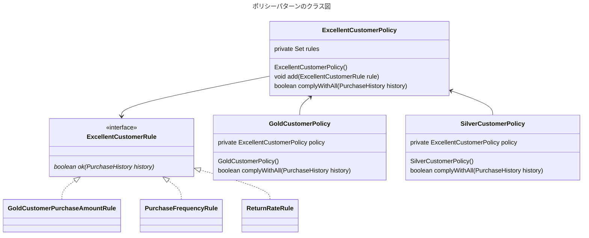

---
tags:
  - 設計
  - interface設計
  - ポリシーパターン（policyパターン）
---

# interface設計の考え方
## interfaceの設計
interfaceの設計は以下の順序で行うとよい。

- 機能を取り換える単位を見つける
- インターフェースと実装の分離に基づき結果と入力を整理する。
- interfaceを定義する
- interfaceを実装する
- 機能を取り換える仕組みを作る

### 実践
#### 機能を取り換える単位を見つける
ECサイトを例に以下の仕様の実装を検討する

> - 毎年7月1日に、ノーマルを除く特定ランクの会員に対し、年間ボーナスポイントを還元する
> - ポイントはランクごとに異なる。
>     - シルバーの場合、過去1年間の購入費が10万円以上の場合、過去1年間の購入費の1%をポイントとして還元する
>     - ゴールドの場合、1000ポイントと過去1年の購入費の2%をポイントとして還元する

まずは使用を整理する

|会員ランク|年間ポイントボーナス|
|-|-|
|ノーマル|なし|
|シルバー|過去1年間の購入費が10万円以上の場合、過去1年間の購入費の1%をポイントとして還元|
|ゴールド|1000ポイント+過去1年間の購入費の2%|

#### 入力と結果が同じかどうかを確認する
|獲得したい結果|結果の獲得に必要な入力|
|-|-|
|年間ボーナスポイント|過去1年間の購入費|

#### interfaceを定義する
過去1年間の購入費はPurchaseHistoryから取得できる前提とする

```java title="会員特典interface"
interface CustomerBenefit {
    ShoppingPoint yearlyPointBonus(final PurchaseHistory history);
}
```

#### interfaceをを実装したクラスを作る

```java title="会員特典interfaceを実装する"
class NormalCustomerBenefit implements CustomerBenefit {
    @Override
    ShoppingPoint yearlyPointBonus(final PurchaseHistory history) {
        return new ShoppingPoint(0);
    }
}

class SilverCustomerBenefit implements CustomerBenefit {
    private static final int POINT_BONUS_APPLICABLE_AMOUNT = 100000;
    private static final double POINT_BACK_RATE = 0.01;

    @Override
    ShoppingPoint yearlyPointBonus(final PurchaseHistory history) {
        if (POINT_BONUS_APPLICABLE_AMOUNT <= history.yearlyAmount()) {
            final int pointBonus = (int) (history.yearlyAmount() * POINT_BACK_RATE);
            return new ShoppingPoint(pointBonus);
        }
        return new ShoppingPoint(0);
    }
}


class GoldCustomerBenefit implements CustomerBenefit {
    private static final int FIXED_POINT_BONUS = 1000;
    private static final double POINT_BACK_RATE = 0.02;

    @Override
    ShoppingPoint yearlyPointBonus(final PurchaseHistory history) {
        final int pointBonus = FIXED_POINT_BONUS + (int) (history.yearlyAmount() * POINT_BACK_RATE);
        return new ShoppingPoint(pointBonus);
    }
}
```

#### 機能を取り換える仕組みを作る
enumとMapで取り換えられる仕組みを作る。
- enumにランクを定義する
- intarfaceにstaticファクトリを用意して、Mapで実装クラスを保持する。

```java title="機能を取り換える仕組み"
enum CustomerRank {
    normal,
    silver,
    gold
}

interface CustomerBenefit {
    ShoppingPoint yearlyPointBonus(final PurchaseHistory history);

    static Map<CustomerRank, CustomerBenefit> createAll() {
        return Map.of(
                CustomerRank.normal, new NormalCustomerBenefit(),
                CustomerRank.silver, new SilverCustomerBenefit(),
                CustomerRank.gold, new GoldCustomerBenefit()
        );
    }
}

class CustomerBenefits {
    private final Map<CustomerRank, CustomerBenefit> benefits;

    CustomerBenefits() {
        benefits = CustomerBenefit.createAll();
    }

    CustomerBenefit select(final CustomerRank customerRank) {
        return benefits.get(customerRank);
    }
}
```

実際に呼び出すコード

```java title="実際に呼び出すコード"
PurchaseHistory purchaseHistory = new PurchaseHistory();

CustomerBenefits customerBenefits = new CustomerBenefits();
final CustomerBenefit customerBenefit = customerBenefits.select(CustomerRank.gold);
final ShoppingPoint shoppingPoint = customerBenefit.yearlyPointBonus(purchaseHistory);
```



## 応用的な設計
ECサイトにおいて、優良顧客かどうかを判定するロジックで、顧客の購入履歴を調べ、次の条件をすべて満たす場合にぞれぞれのランクの優良顧客と判断する

**ゴールド会員**

- これまでの購入金額が10万円以上
- 1か月あたりの購入頻度が10回以上
- 返品率が0.1%以内

**シルバー会員**

- これまでの購入金額が10万円以上
- 返品率が0.1%以内

```java title="会員判定ロジック"
/**
 *
 * @param history 購入履歴
 * @return ゴールド会員である場合true
 */
boolean isGoldCustomer(PurchaseHistory history) {
    if (10 <= history.purchaseFrequencyPerMonth) {
        if (100000 <= history.totalAmount) {
            if (history.returnRate <= 0.001) {
                return true;
            }
        }
    }
    return false;
}
/**
 *
 * @param history 購入履歴
 * @return シルバー会員である場合true
 */
boolean isSilverCustomer(PurchaseHistory history) {
    if (10 <= history.purchaseFrequencyPerMonth) {
        if (history.returnRate <= 0.001) {
            return true;
        }
    }
    return false;
}
```

このコードの問題点として、同じ判定ロジックがそれぞれのメソッドに実装されている。  
もし、仮にブロンズ会員などが追加される場合、また同じロジックを実装する羽目になる。

### ポリシーパターンで条件を集約する
ポリシーパターン（Policyパターン）は判定条件（ルール）を部品化して部品化した条件の組み換えを可能にする。

まずは、判定条件（ルール）を表現するためのinterfaceを作る
```java
/** 優良顧客のルールを表現するinterface */
interface ExcellentCustomerRule {
    /**
     *
     * @param history 条件を満たす場合true
     * @return 購入履歴
     */
    boolean ok(final PurchaseHistory history);
}

/** ゴールド会員の購入金額ルール */
class GoldCustomerPurchaseAmountRule implements ExcellentCustomerRule {
    @Override
    boolean ok(final PurchaseHistory history) {
        return 100000 <= history.totalAmount;
    }
}

/** 購入頻度のルール */
class PurchaseFrequencyRule implements ExcellentCustomerRule {
    @Override
    boolean ok(final PurchaseHistory history) {
        return 10 <= history.purchaseFrequencyPerMonth;
    }
}

/** 返品率のルール */
class ReturnRateRule implements ExcellentCustomerRule {
    @Override
    boolean ok(final PurchaseHistory history) {
        return history.returnRate <= 0.001;
    }
}
```

次にポリシークラスを用意して、addメソッドでルールを集約する。  
complyWithAllメソッドでルールをすべて満たすか判定する。

```java
/**
 * 優良顧客の方針を表現するクラス
 */
class ExcellentCustomerPolicy {
    private final Set<ExcellentCustomerRule> rules;

    ExcellentCustomerPolicy() {
        rules = new HashSet<>();
    }

    /**
     * ルールを追加する
     * @param rule ルール
     */
    void add(final ExcellentCustomerRule rule) {
        rules.add(rule);
    }

    /**
     *
     * @param history 購入履歴
     * @return ルールを全て満たす場合true
     */
    boolean complyWithAll(final PurchaseHistory history) {
        for (ExcellentCustomerRule each : rules) {
            if (!each.ok(history))
                return false;
        }
        return true;
    }
}

/** ゴールド会員の方針 */
class GoldCustomerPolicy {
    private final ExcellentCustomerPolicy policy;

    GoldCustomerPolicy() {
        policy = new ExcellentCustomerPolicy();
        policy.add(new GoldCustomerPurchaseAmountRule());
        policy.add(new PurchaseFrequencyRule());
        policy.add(new ReturnRateRule());
    }

    /**
     *
     * @param history 購入履歴
     * @return ルールを全て満たす場合true
     */
    boolean complyWithAll(final PurchaseHistory history) {
        return policy.complyWithAll(history);
    }
}

/** シルバー会員の方針 */
class SilverCustomerPolicy {
    private final ExcellentCustomerPolicy policy;

    SilverCustomerPolicy() {
        policy = new ExcellentCustomerPolicy();
        policy.add(new PurchaseFrequencyRule());
        policy.add(new ReturnRateRule());
    }

    /**
     *
     * @param history 購入履歴
     * @return ルールを全て満たす場合true
     */
    boolean complyWithAll(final PurchaseHistory history) {
        return policy.complyWithAll(history);
    }
}
```

※GoldCustomerPolicy、SilverCustomerPolicyのコンストラクタでインスタンス生成をしているが、これはファクトリーにしてもよい。  
その場合、ExcellentCustomerRuleインターフェースにgoldやsilverのファクトリメソッドを作りのは止めた方がいい。理由としてはExcellentCustomerRuleは「ルールを表現するinterfaceが、Policyの生成まで担当している」というのは責務の混在が起きるため。  
ファクトリーにするなら、ちゃんとファクトリークラスを作った分離した方がいい。

```java title="ポリシーの使用"
PurchaseHistory purchaseHistory = new PurchaseHistory();
GoldCustomerPolicy goldCustomerPolicy = new GoldCustomerPolicy();
if (goldCustomerPolicy.complyWithAll(purchaseHistory)) {
    System.out.println("ゴールド会員です。");
}
```

