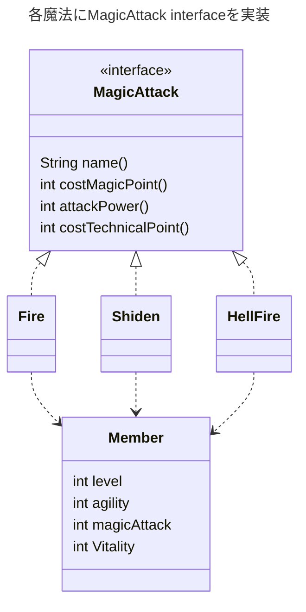
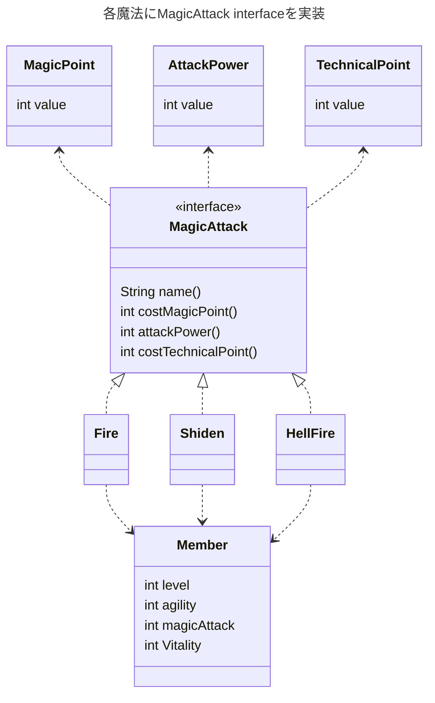

---
tags:
- 設計
- アンチパターン
- カプセル化
- switch文
---

# switch文の重複
## 弊害
```java title="同じ条件でswitch文を複数実装している例"
enum MagicType {
    fire,  // ファイア。炎の魔法
    shiden  // 紫電。雷の魔法
}

class MagicManager {

    /** 魔法の名前する */
    String getName(MagicType magicType) {
        String name = "";

        switch (magicType) {
            case fire:
                name = "ファイア";
                break;
            case shiden:
                name = "紫電";
                break;
        }

        return name;
    }

    /** 消費魔法力を取得する */
    int costMagicPoint(MagicType magicType, Member member) {
        int magicPoint = 0;

        switch (magicType) {
            case fire:
                magicPoint = 2;
                break;
            case shiden:
                magicPoint = 3;
                break;
        }

        return magicPoint;
    }

    /** 消費魔法力を取得する */
    int attackPower(MagicType magicType, Member member) {
        int attackPower = 0;

        switch (magicType) {
            case fire:
                attackPower = 20 + (int) (member.level * 0.5);
                break;
            case shiden:
                attackPower = 50 + (int) (member.agility * 1.5);
                break;
        }

        return attackPower;
    }
}
```

- 新たにenum(魔法)や、メソッド（テクニカルポイントを消費するなど）が仕様変更、追加されたりした場合、修正漏れが発生する可能性がある。

## 条件を一か所にまとめる

同じ条件式の条件分岐を書かずに、一か所にまとめると仕様変更時の抜け漏れを防止できる。
```java title="条件を一か所にまとめた例"
enum MagicType {
    fire,  // ファイア。炎の魔法
    shiden,  // 紫電。雷の魔法
    hellFire
}
class Magic {
    final String name;  // 名前
    final int costMagicPoint;  // 消費魔法力
    final int attackPower;  // 攻撃力
    final int costTechnicalPoint;  // 消費テクニカルポイント

    Magic(final MagicType magicType, final member member) {
        switch (magicType) {
            case fire:
                name = "ファイア";
                costMagicPoint = 2;
                attackPower = 20 + (int) (member.level * 0.5);
                costTechnicalPoint = 0;
                break;
            case shiden:
                name = "紫電";
                costMagicPoint = 5 + (int) (member.level * 0.2);
                attackPower = 50 + (int) (member.agility * 1.5);
                costTechnicalPoint = 5;
                break;
            case hellFire:
                name = "地獄の業火";
                costMagicPoint = 16;
                attackPower = 20 + (int) (member.agility * 0.5 + member.vitality * 2);
                costTechnicalPoint = 20 + (int) (member.level * 0.4);
                break;
            default:
                throw new IllegalArgumentException();
        }
    }
}
```

## よりスマートのswitch文重複を解消するinterface
「条件を一か所にまとめる」にパートで一か所にまとめられたが、切り替えたいものが増えた場合にロジックがどんどん膨らんでいきクラスが巨大化する。  
クラスが巨大化するとデータやロジックの関係性が入り組んで保守の難しいコードになる。  
従って巨大化したクラスは関心事ごとの小さなクラスに分割するとよい。

### interface命名
interfaceの名前の決め方はいくつかあるがその一つが「取り替えたい機能の目的」に着目して命名すること。  
「ファイア」「紫電」「地獄の業火」の目的は、魔法での攻撃である。したがってMagicAttackとする。
同じ条件式の条件分岐を書かずに、一か所にまとめると仕様変更時の抜け漏れを防止できる。

```java title="interfaceで関心を分離した例"
interface MagicAttack {
    String name();  // 名前
    int costMagicPoint();  // 消費魔法力
    int attackPower();  // 攻撃力
    int costTechnicalPoint();  // 消費テクニカルポイント
}

class Fire implements MagicAttack {
    private final Member member;

    Fire(final Member member) { this.member = member; }
    @Override public String name() { return "ファイア"; }
    @Override public int costMagicPoint() { return 2; }
    @Override public int attackPower() { return 20 + (int)(member.level * 0.5); }
    @Override public int costTechnicalPoint() { return 0; }
}
class Shiden implements MagicAttack {
    private final Member member;

    Shiden(final Member member) { this.member = member; }
    @Override public String name() { return "紫電"; }
    @Override public int costMagicPoint() { return 5 + (int) (member.level * 0.2); }
    @Override public int attackPower() { return 50 + (int) (member.agility * 1.5); }
    @Override public int costTechnicalPoint() { return 5; }
}
class HellFire implements MagicAttack {
    private final Member member;

    HellFire(final Member member) { this.member = member; }
    @Override public String name() { return "地獄の業火"; }
    @Override public int costMagicPoint() { return 16; }
    @Override public int attackPower() { return 20 + (int) (member.agility * 0.5 + member.vitality * 2); }
    @Override public int costTechnicalPoint() { return 20 + (int) (member.level * 0.4); }
}
```



### Mapで機能を取り換える
Mapを使えばswitch文を使わずに魔法ごとの機能を取り換えができるようになる。  
これをStrategy RegistryとかStrategy Mapとかって言われるらしい。

また、Magicクラスでmapを作っているが、interfaceにstaticファクトリ―として実装した方がきれいになりそう。

```java title="Mapで機能を切替える例"
class Magic {
    Map<MagicType, MagicAttack> magicAttacks;

    Magic(final Member member) {
        this.magicAttacks = Map.of(
                MagicType.fire, new Fire(member),
                MagicType.shiden, new Shiden(member),
                MagicType.hellFire, new HellFire(member)
        );
    }

    void attack(final MagicType magicType) {
        final MagicAttack usingMagicAttack = magicAttacks.get(magicType);

        showMagicName(usingMagicAttack);
        consumeMagicPoint(usingMagicAttack);
        consumeTechnicalPoint(usingMagicAttack);
        magicDamage(usingMagicAttack);
    }

    void showMagicName(final MagicAttack magicAttack) {
        final String name = magicAttack.name();
        // nameを使った表示処理
    }

    void consumeMagicPoint(final MagicAttack magicAttack) {
        final int costMagicPoint = magicAttack.costMagicPoint();
        // costMagicPointを使った魔法力消費処理
    }

    void consumeTechnicalPoint(final MagicAttack magicAttack) {
        final int costTechnicalPoint = magicAttack.costTechnicalPoint();
        // costTechnicalPointを使ったテクニカルポイント消費処理
    }

    void magicDamage(final MagicAttack magicAttack) {
        final int attackPower = magicAttack.attackPower();
        // attackPowerを使ったダメージ計算
    }
}
```

### 丁寧に値オブジェクト化する
costMagicPoint、attackPower、costTechnicalPointはint型であるため、値の渡し間違いがあるかもしれないから、値オブジェクトにして防止する。

```java title="値オブジェクト化した例"
interface MagicAttack {
    String name();  // 名前
    MagicPoint costMagicPoint();  // 消費魔法力
    AttackPower attackPower();  // 攻撃力
    TechnicalPoint costTechnicalPoint();  // 消費テクニカルポイント
}

class Fire implements MagicAttack {
    private final Member member;

    Fire(final Member member) {
        this.member = member;
    }

    @Override
    public String name() {
        return "ファイア";
    }

    @Override
    public MagicPoint costMagicPoint() {
        return new MagicPoint(2);
    }

    @Override
    public AttackPower attackPower() {
        final int value = 20 + (int) (member.level * 0.5);
        return new AttackPower(value);
    }

    @Override
    public TechnicalPoint costTechnicalPoint() {
        return new TechnicalPoint(0);
    }
}

class Shiden implements MagicAttack {
    private final Member member;

    Shiden(final Member member) {
        this.member = member;
    }

    @Override
    public String name() {
        return "紫電";
    }

    @Override
    public MagicPoint costMagicPoint() {
        final int value = 5 + (int) (member.level * 0.2);
        return new MagicPoint(value);
    }

    @Override
    public AttackPower attackPower() {
        final int value = 50 + (int) (member.agility * 1.5);
        return new AttackPower(value);
    }

    @Override
    public TechnicalPoint costTechnicalPoint() {
        return new TechnicalPoint(5);
    }
}

class HellFire implements MagicAttack {
    private final Member member;

    HellFire(final Member member) {
        this.member = member;
    }

    @Override
    public String name() {
        return "地獄の業火";
    }

    @Override
    public MagicPoint costMagicPoint() {
        return new MagicPoint(16);
    }

    @Override
    public AttackPower attackPower() {
        final int value = 20 + (int) (member.agility * 0.5 + member.vitality * 2);
        return new AttackPower(value);
    }

    @Override
    public TechnicalPoint costTechnicalPoint() {
        final int value = 20 + (int) (member.level * 0.4);
        return new TechnicalPoint(value);
    }
}
```
