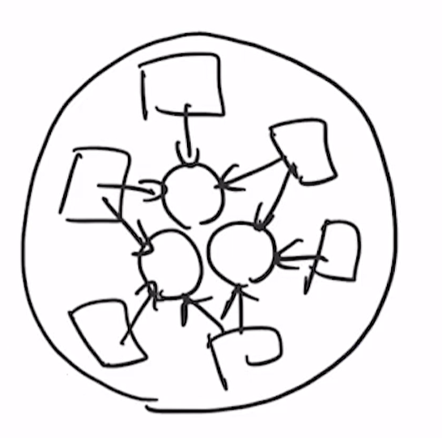
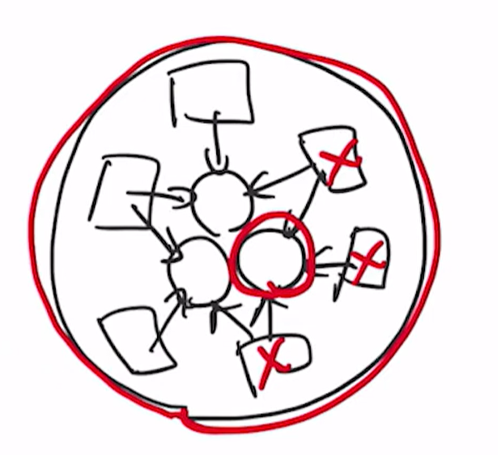

---
tags:
  - 設計
  - カプセル化
  - 完全コンストラクタ
  - 値オブジェクト
---

# カプセル化
## カプセル化の目的
データと関係する処理をひとまとめにして、仕様変更に強くするための設計の **土台** を作る。  


## カプセル化の工程
関係するデータをまとめる

- 第1段階
> 関係するデータをまとめる  
> 言い方を変えると、他の場所にはそのデータを必要とする処理がない状態

- 第2段階
> そのデータを必要とする処理を1つにまとめる

カプセル化をすることで、データ構造の変更がある場合に影響範囲の特定が容易になる


## カプセル化の実装テクニック
### コンストラクタで不正値の混入を防ぐ
- 生焼けオブジェクトがにならないように、デフォルトコンストラクタを使わず、引数ありのコンストラクタでインスタンス変数を全て初期化する
- 不正値をガード節で弾く
- イミュータブルにしてインスタンス変数の上書きを禁止する
- メソッド引数やローカル変数にもfinalで不変にする
    - 途中で値が変化すると追うのが難しくなる。基本的に引数は変数するものではない
- 値の渡し間違いを型で防止する
  
```java
import java.util.Currency;
import java.util.Locale;
import java.util.Objects;

public class Main {
    public static void main(String[] args) {
        // Money money = new Money();  生焼け防止
        // Money money = new Money(-100, null);  不値混入の防止
        Money money = new Money(100, Currency.getInstance(Locale.JAPAN));
        // money.amount = -200;  代入を許さない
    }
}

class Money {
    final int amount;
    final Currency currency;

    Money(final int amount, final Currency currency) {
        if (amount < 0) {
            throw new IllegalArgumentException("金額には0以上を指定してください。");
        }

        this.amount = amount;
        this.currency = Objects.requireNonNull(currency, "通貨単位を設定してください。");
    }

    Money add(final Money other) {
        if (!Objects.equals(currency, other.currency))
            throw new IllegalArgumentException("通貨単位が違います。");

        final int added = amount + other.amount;
        return new Money(added, currency);
    }
}
```

上記のような設計のクラスは **完全コンストラクタ** であり **値オブジェクト（ValueObject）** である

#### 完全コンストラクタ
生焼けオブジェクトを防止するため、インスタンス変数を初期化して、さらにガード節で不正値を弾き、正常値だけを持つ完全なインスタンスを生成するためのコンストラクタ。

#### 値オブジェクト（ValueObject）
値の概念そのものをクラスとして定義してカプセル化されたクラス。  
値オブジェクトの比較は同値性（等値性/等価性）で判断される。