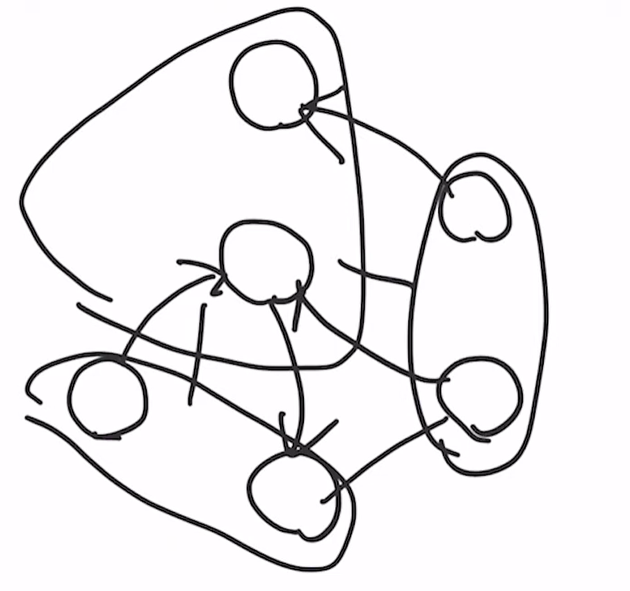
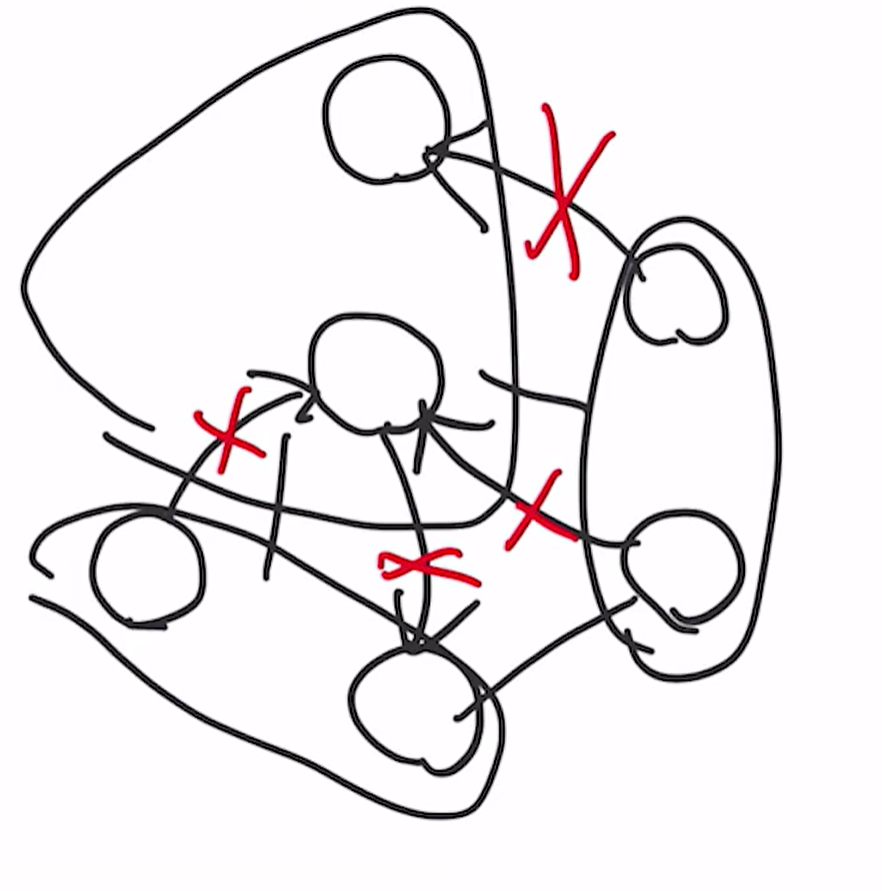
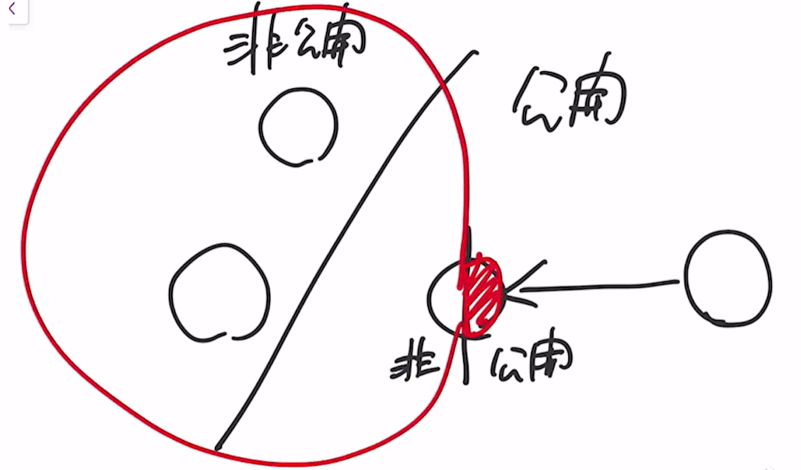
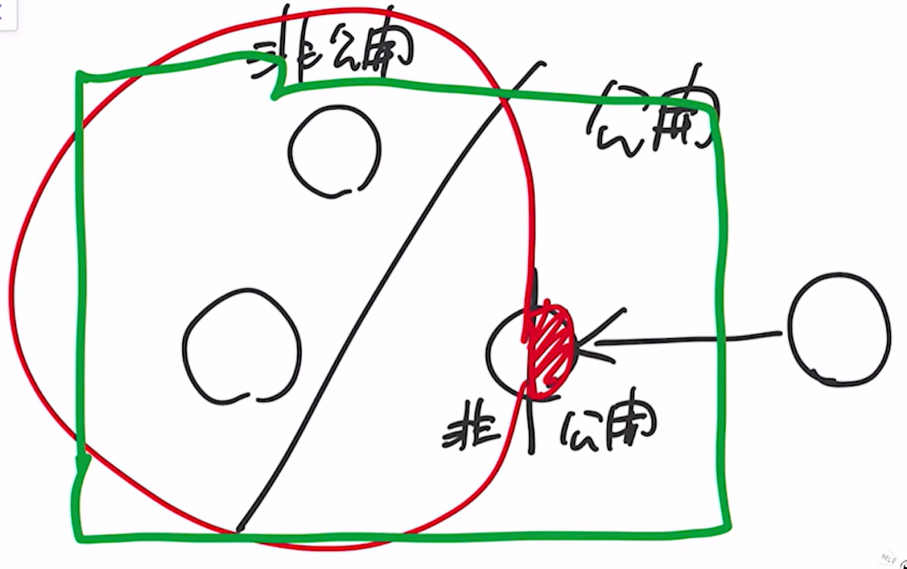
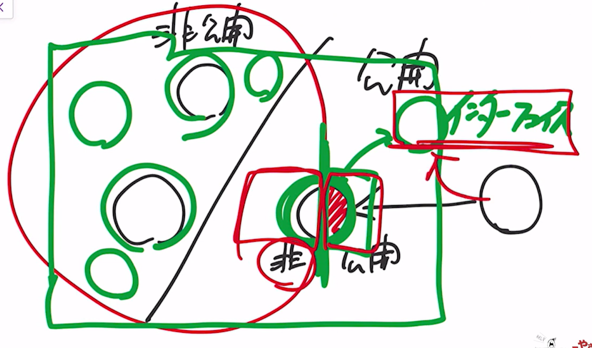
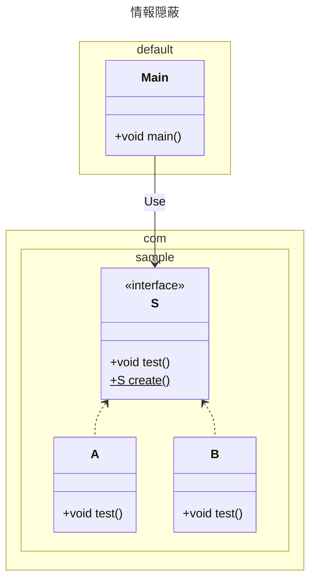

---
tags:
  - 設計
  - 抽象化
  - 情報隠蔽
---

# 情報隠蔽
## 情報隠蔽とは
システムやモジュールといったソフトウェアの部品がどういった構造で出来上がっているのかという情報を隠す。

## 情報隠蔽をしない場合に起きること
仕様変更の対応などでプログラムを修正することになった場合、例えばメンバーの入れ替わりなどでシステムの構造をよく知らなかったり、経験の浅いエンジニアがアクセスしてはいけないモジュールにアクセスしてシステムを疎結合にして、結果システムがどんどん複雑になる。



これに関しては、後から劣化するかもしれないということを想定した設計でないことが問題  
公開するモジュールと非公開にするモジュールを決めて、アクセス制御をかける



## 情報隠蔽を実現する方法
パッケージによってアクセス制御を管理する

まず、公開するもの非公開にするものを全部一つのパッケージにまとめる


そして公開する部分をクラスから分離して、インターフェースとする


### アクセス修飾子について
javaの言語設計者は基本となるデフォルトのアクセス修飾子を定めている。それがパッケージデフォルト（アクセス修飾子なし）  
何でもかんでもpublicにする人がいるが、情報隠蔽が全くできていない。

基本的に公開(public)するクラスはほとんどない。9割型ない。

### 実装例
```text title="パッケージ構成"
C:\Users\hirok\work\SampleJava\src
│  Main.java
│
└─com
    └─sample
            A.java
            B.java
            S.java
```

```java title="デフォルトパッケージ"
import sample.Test;

public class Main {
    public static void main(String[] args) {
        Test test = new Test();
        test.process(() -> System.out.println("Hello with Lambda."));
    }
}
```
```java title="com.sampleパッケージ"
import com.sample.S;

public class Main {
    public static void main(String[] args) {
        // S s = new A();  アクセス不可
        // S s = new B();  アクセス不可
        S s = S.create();
        s.test();
    }
}

```
```java title="com.sampleパッケージ"
package com.sample;

public interface S {
    void test();
    static S create() {
        return new B();
    }
}
```
```java title="com.sampleパッケージ"
package com.sample;

class A implements S {
    public void test() {
        System.out.println("A");
    }
}
```
```java title="com.sampleパッケージ"
package com.sample;

class B implements S {
    public void test() {
        System.out.println("B");
    }
}
```
