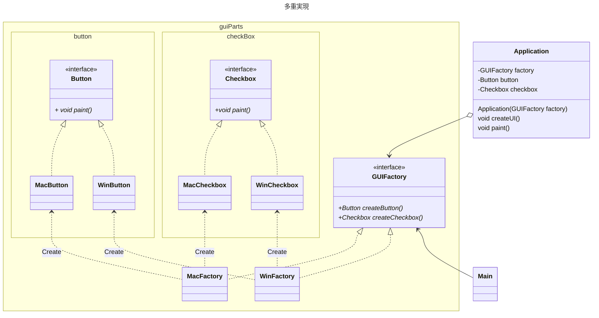

# AbstractFactory

```mermaid
---
title: 多重実現
---
classDiagram
    class Application {
        -GUIFactory factory
        -Button button
        -Checkbox checkbox

        Application(GUIFactory factory)
        void createUI()
        void paint()
    }
    class Main {
    }

    namespace guiParts {
        class GUIFactory <<interface>> {
            +Button createButton()*
            +Checkbox createCheckbox()*
        }
        class MacFactory {
        }
        class WinFactory {
        }
    
        namespace button {
            class Button <<interface>> {
                + void paint()*
            }
            class MacButton {
            }
            class WinButton {
            }
        }
        
        namespace checkBox {
            class Checkbox <<interface>> {
                +void paint()*
            }
            class MacCheckbox {
            }
            class WinCheckbox {
            }
        }
    }

    Button <|.. MacButton
    Button <|.. WinButton
    Checkbox <|.. MacCheckbox
    Checkbox <|.. WinCheckbox

    GUIFactory <|.. MacFactory
    GUIFactory <|.. WinFactory

    MacButton <.. MacFactory:Create
    MacCheckbox <.. MacFactory:Create
    WinButton <.. WinFactory:Create
    WinCheckbox <.. WinFactory:Create

    Application o--> GUIFactory
    GUIFactory <-- Main
    
```