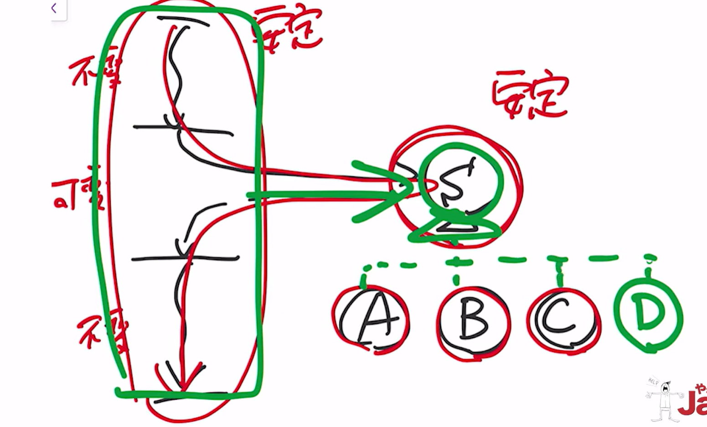

# 可変量分析
仕様変更が入りやるい部分と入りにくい部分を見分けを付けて、変わる量の多い少ないを分析すること

# 参考サイト
[【オブジェクト指向のこころ】15章 共通性/可変性分析](https://kyonc5.hatenablog.com/entry/2021/06/19/112754?utm_source=chatgpt.com)
[【オブジェクト指向のこころ 第15章の振り返り](https://zenn.dev/yasuorizumi/articles/object-orientation-summary-15?utm_source=chatgpt.com)
[その設計、変更に強いですか?単体テストできますか?...そしてクリーンアーキテクチャ](https://qiita.com/Sekky0905/items/2436d669ff5d4491c527?utm_source=chatgpt.com)
