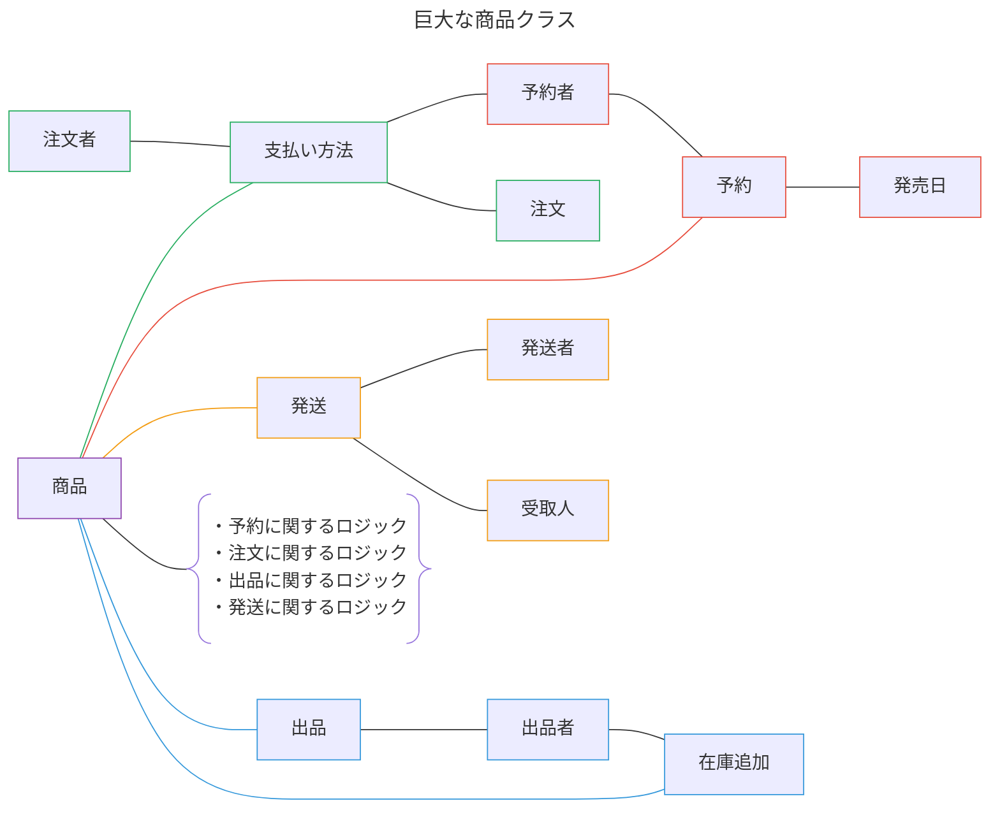
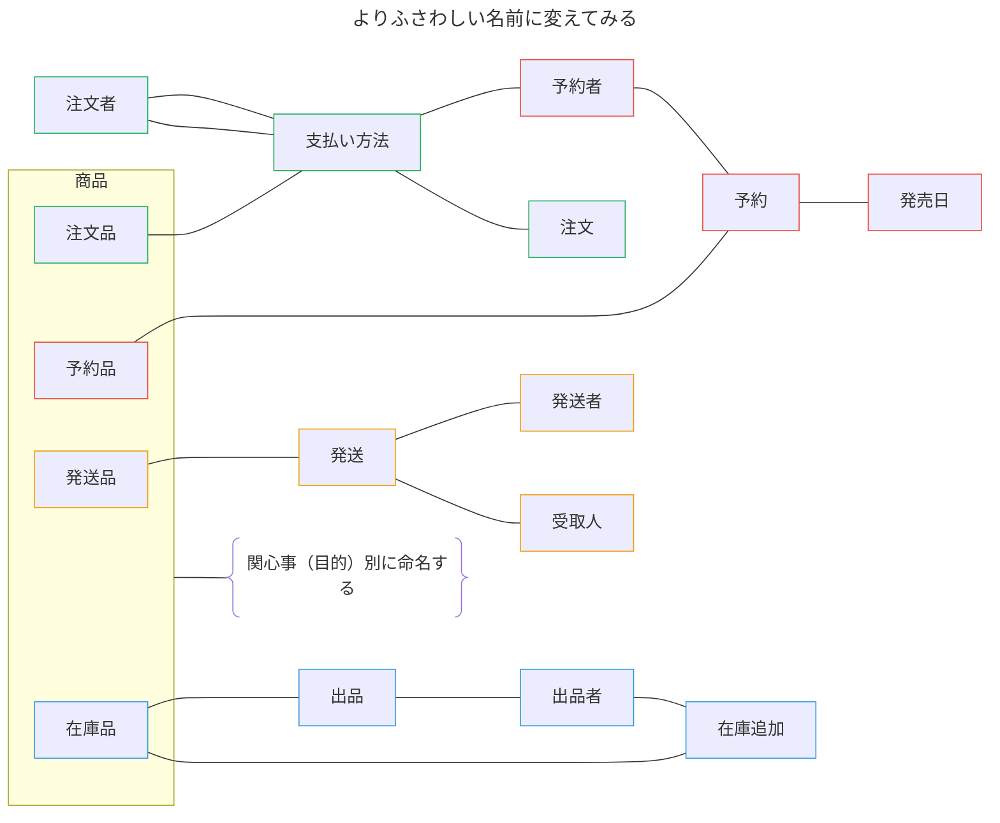
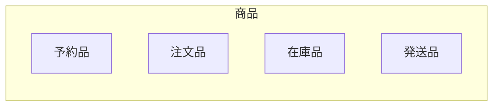
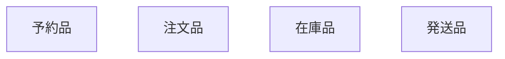

---
tags:
- 設計
- 名前設計
---

# 名前設計
名前をないがしろにすると、関心が入り乱れて複雑化、巨大化する。

以下を意識して、名前を設計するよと言

- 命名するにあたっての基本的な考え方は、ソフトウェアで達成したい目的に焦点を合わせて名前を設計する。
- 名前から目的や意図が読み取れることを重視して、単一責任の原則を守る設計のように、名前に着目して問題解決を図る

## 名前設計が不十分で関心事が入り混じったクラスと改善
以下例は、ECサイトでの商品を例にしてる。

商品を中心の出品、予約、注文、発送などの商品を取り扱うユースケース。  
従って商品は様々なユースケースと結びつく。

このようなクラスは以下のような弊害を持つ。

- 結びついたクラスに関係するロジックを持ち始め、どんどん巨大化複雑化していく。
- 商品クラスに仕様変更が発生した場合、商品クラスに関連のあるクラス全てをチェックしなければいけない。

### 関心事ごとに分離する
関心事それぞれに商品クラスを分割する。
分割した商品を違う名前で命名する。

関心を分離しておけば、仕様変更が生じた場合の影響範囲を小さくできる。

### 大雑把で意味が不明瞭な名前
> 社員A「今度の仕様変更で、開発中のECサイトに予約機能が追加される。予約のロジック追加が商品周りでも必要だと思うけど、どこに実装しよう？」  
> 社員B「勝因クラスが既にあるじゃないか。商品クラスに実装しちまえよ」

「商品」という名前が大雑把すぎて、商品に関するあらゆるロジックが実装できてしまいそうに見えてしまう。  
**<mark>大雑把で意味がガバガバな名前は、あらゆるロジックを引き付けてしまう、強力な心理的引力が働く。</mark>**

関心の分離を意識した名前の設計には、業務目的を名前として表現することがポイント。

## 目的駆動名前設計
ソフトウェアで達成したい目的や意図を名前から読み取れるようにする。

- 可能な限り具体的で、意味が狭い、目的に特化した名前を選ぶ
- 存在駆動ではなく、目的駆動で名前を考える
- どんな業務目的があるかを分析する
- 声に出して話してみる
- 利用規約を読んでみる
- 違う名前に置き換えられないか検討する
- 関心が分離されているか点検する

### 可能な限り具体的で、意味が狭い、目的に特化した名前を選ぶ

目的に特化した名前を使う↓

業務目的に特化することで、以下の効果が生まれる。

- 名前とは無関係なロジックを排除しやすくなる
- クラスが小さくなる
- 関係するクラスの数が少なくなる
- 関係クラス個数が少ないから、仕様変更時に考慮する影響範囲が小さくする
- 目的に特化した名前だから、どこを変更すればいいのかすぐに探し出せる
- 開発生産性が向上できる

### 存在駆動ではなく、目的駆動で名前を考える
**目的に特化していないケース**

例えば「人」や「ユーザー」といった、人物が存在することに着目した存在駆動の名前を考えてみる。

ECサイトでは利用者は、個人以外に法人があり、「ユーザー」が個人、法人両方の意味を持ち関心事が混ざってしまう可能性がある

**目的に特化したケース**

|存在駆動|目的駆動|
|-|-|
|住所|配送元、配送先、勤務先、本籍地|
|金額|請求金額、消費税額、延滞保証料、キャンペーン割引料金|
|ユーザー|アカウント、個人プロフィール、職務経歴|
|ユーザー名|アカウント名、表示名、本名、法人名|
|商品|入庫品、予約品、注文品、配送品|

### どんな目的があるか分析する
目的に特化した命名を知るには、どんな業務目的があるか網羅する必要がある。  
そのため、ソフトウェアが対象とする目的や事柄を分析する必要がある。

|ソフトウェア|目的の例|
|-|-|
|ECサイト|キャンペーンセールで顧客の購買意欲を喚起したい、まとめ買いを励行させて配送料低減を実現したい|
|ゲーム|武器の強化やカスタマイズをして楽しんでほしい、罠による対戦駆け引きを楽しんでほしい|
|社内向けライブラリ|自部門の開発生産性を高めたい、複数の製品ラインナップを同じ方向で制御できるようにして開発を楽に進めたい|

例えば、上記のような目的を整理するすることが大事。

登場人物をや事柄を列挙したり、関係性を整理したり。  
チームで集まって、ホワイトボードや模造紙に書いてみたり。  
付箋を使って、関係し合うものをグルーピングしたり。

### 声に出してみる
業務の視点から背景や意図を整理し、チームで理解を一致させることが重要。  
業務に詳しい人と話し合ってみること。

また、以下のようなことも効果的

**ラバーダッキング**

プログラミングで何か問題が発生した時に、それを誰かに説明して自ら原因に気づき、自己解決する手法。

**ユビキタス言語**

チーム全体で糸を共有するための言葉。
同じ意図の名前を会話、ドキュメント、クラス図やメソッド名で共有して使うことで意図が伝わりやすくなり、設計のいびつさを解消するのに役立つ