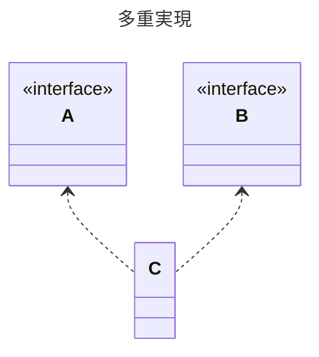
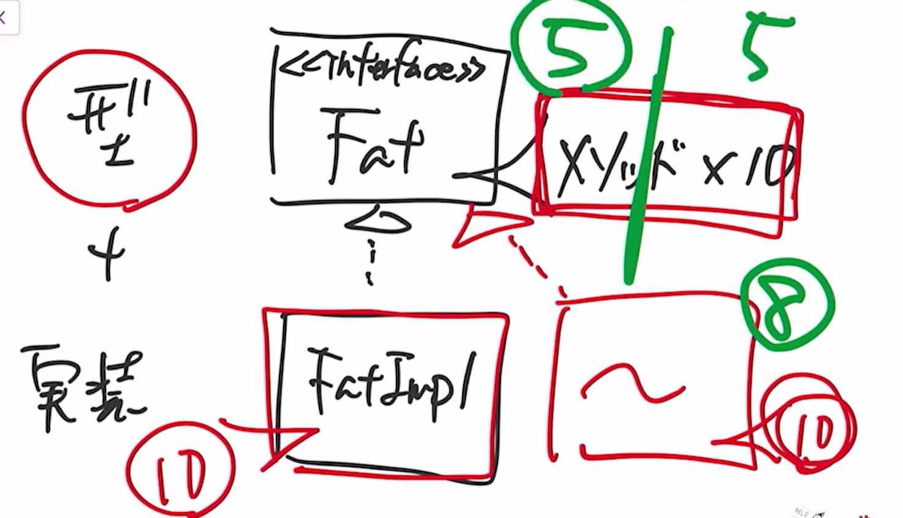

---
tags:
  - プログラミング
  - 設計
  - インターフェース分離の原則
---

# 多重実現が必要な理由
## 多重実現とは
複数のインターフェースを実装すること

## インターフェース分離の原則
沢山の抽象メソッドを定義したIFがあって、そのIFの実装クラスを作りたいとした場合、  
一部のメソッドのみを実装すればよいのに、IFフェースで定義されている抽象メソッドを全て実装しなければいけない。

*図：巨大なIF*

そういった場合にあらかじめIFを必要な機能の単位に分割しておいて、必要なIFを実装したクラスを作る考え方を **インターフェース分離の原則**と呼ぶ

*図：IFを分離*