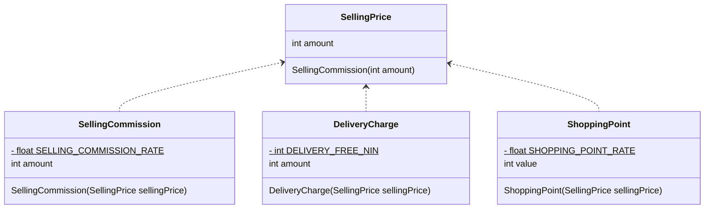

---
tags:
  - 設計
  - カプセル化
  - 関心の分離
  - 影響スケッチ
---

# 関心の分離
## 関心の分離の基本
役割の違うデータやロジックが同じクラスに存在して状態では、データとロジックの関係性が把握しづらくなる。

このような混乱を解消するための考え方が関心事の分離。  
関心とは、ソフトウェアの機能や目的のことで、 **関心事の分離とは、それぞれの関心でモジュールを独立させ、他の関心とは分離する考え方。** 

### インスタンス変数ごとにクラスを分割する。
```java title="関心が分離できていない例"
class Util {
    private int reservationId;  // 商品の予約ID
    private ViewSettings viewSettings;  // 画面表示設定
    private MailMagazine mailMagazine;  // メールマガジン

    void cancelReservation() {}  // reservationIdを使った予約キャンセル処理
    void darkMode() {}  // viewSettingsを使ったダークモード表示への変更処理
    void beginSendMail() {}  // mailMagazineを使ったメール配信開始
}
```

上記コードをよく見ると、それぞれのメソッドがどのインスタンス変数を使うか決まっている。  
メソッドとインスタンス変数の依存関係が1対1であるため、各メソッドはお互いに依存に関係はない。  
関係しないものは分離するとよい。
```java title="関心毎にクラスを分離した例"
class Reservation {
    private final int reservationId;
    // コンストラクタは省略
    void cancel() {}  // reservationIdを使った予約キャンセル処理
}

class ViewCustomizing {
    private final ViewSettings viewSettings;
    // コンストラクタは省略
    void darkMode() {}  // viewSettingsを使ったダークモード表示への変更処理
}

class MailMagazineService {
    private final MailMagazine mailMagazine;
    // コンストラクタは省略
    void darkMode() {}  // mailMagazineを使ったメール配信開始
}
```

### 影響スケッチ
各インスタンス変数とメソッドがどう依存しているかを図式化したものを **影響スケッチ** という

影響スケッチを自動で描画してくれるツール
- [jig](https://github.com/dddjava/jig)
- [テクマトリックス社のUnderstand（市販の製品）](https://www.techmatrix.co.jp/product/understand/usecases/usecase_Influence.html)

## 目的の違う処理が紛れ込むことに注意
開発が進んでいくと、目的の違う処理が紛れこむことがよくある。  
目的の違うものが紛れ込むと、どこになんのロジックが実装されているのか読み解くのが困難になる。

例えば以下のコードは販売価格を取り扱うコードなのに、販売価格を元に販売手数料、配送料、ショッピングポイントを求めるがゆえに関係していると思い販売価格とは別の概念のロジックが紛れ込んでしまっている。

<mark>強く関係していそうなロジックを一か所にまとめ上げようとしたものの、結果として様々な関心事がまぎれこんでクラスがどんどん膨れ上がるケースよ額あるので要注意。</mark>
```java title="目的の違う処理が紛れ込んだ例"
/** 販売価格 */
class SellingPrice {
    final int amount;

    SellingPrice(final int amount) {
        if (amount < 0) throw new IllegalArgumentException("価格が0以上でありません。");
        this.amount = amount;
    }

    // 販売手数料を計算する
    int calcSellingCommission() {
        return (int) (amount * SELLING_COMMISSION_RATE);
    }

    // 配送料を計算する
    int calcDeliveryCharge() {
        return DELIVERY_FREE_NIN <= amount ? 0 : 500;
    }

    // 獲得するショッピングポイントを計算する
    int calcShoppingPoint() {
        return (int) (amount * SHOPPING_POINT_RATE);
    }
}
```

このような別の概念を取り扱う場合は、目的の異なる概念ごとに分離しカプセル化する。  
具体的には、ある概念の値（販売価格）を使って別の概念の値（販売手数料、配送料、ショッピングポイント）を算出したい場合は、コンストラクタ引数に計算に使う値を渡してあげる。
```java title="目的別に関心を分離した例"
/** 販売手数料 */
class SellingCommission {
    private static final float SELLING_COMMISSION_RATE = 0.05f;
    final int amount;

    SellingCommission(final SellingPrice sellingPrice) {
        amount = (int)(sellingPrice.amount * SELLING_COMMISSION_RATE);
    }
}

/** 配送料 */
class DeliveryCharge {
    private static final int DELIVERY_FREE_NIN = 2000;
    final int amount;

    DeliveryCharge(final SellingPrice sellingPrice) {
        amount = DELIVERY_FREE_NIN <= sellingPrice.amount ? 0 : 500;
    }
}

/** ショッピングポイント */
class ShoppingPoint {
    private static final float SHOPPING_POINT_RATE = 0.01f;
    final int value;

    ShoppingPoint(final SellingPrice sellingPrice) {
        value = (int)(sellingPrice.amount * SHOPPING_POINT_RATE);
    }
}
```

