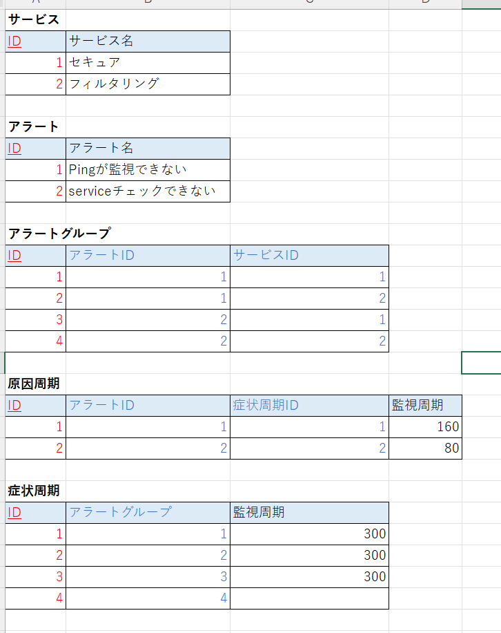

# Memo
- HikariCPとは

[Docker Hab](https://hub.docker.com)

## 設計の原則を知ること
- 設計の幅が広がる
- 何でこのような機能が **用意されている** かを理解できる

## 

## IT英単語
|単語|意味|
|-|-|
|case-sensitive|大文字小文字を区別する|
|case-insensitive|大文字小文字を区別しない|

## 勉強しておくべき関数型プログラミング
- 公開関数
- 部分適用（partical application）
- 関数の合成
- カリー化
- 遅延評価
- パターンマッチ
- 再帰
- モナド
  
## 書籍
### オブジェクト指向関連
- オブジェクト指向入門 第2版 原則・コンセプト

## ツール
影響スケッチを自動で描画してくれるツール
- [jig](https://github.com/dddjava/jig)
- [テクマトリックス社のUnderstand（市販の製品）](https://www.techmatrix.co.jp/product/understand/usecases/usecase_Influence.html)

