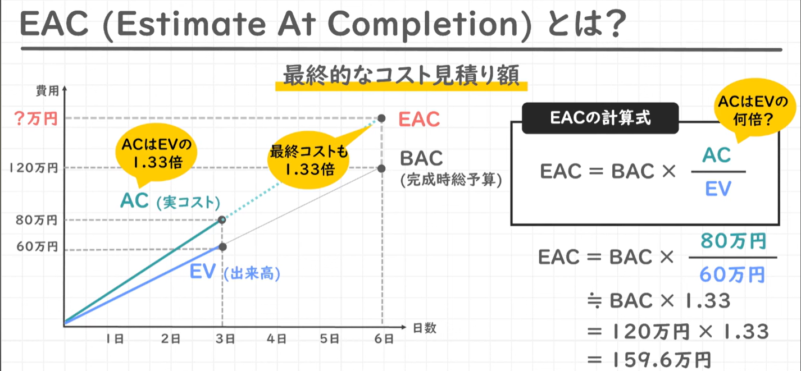
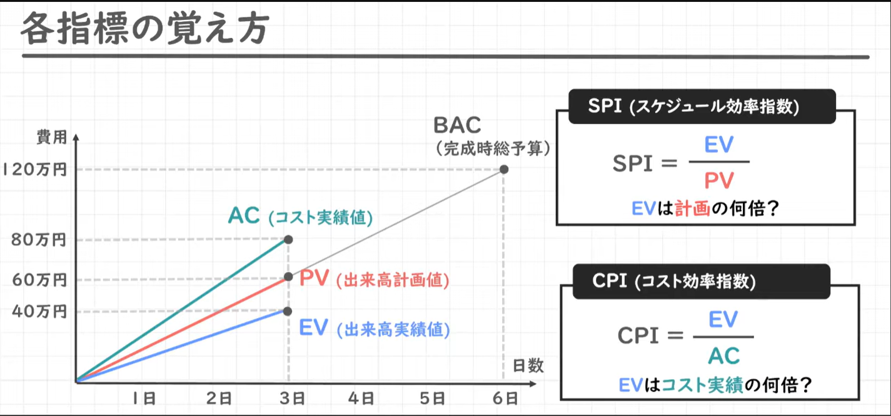

# EVM(Earned Value Management)

## EVMとは
プロジェクト全体の進捗を予算・出来高・実コストの金銭価値で管理する手法

計画価値(PV)に対する出来高(EV)や実コスト(AC)を比較することで、  
想定通りの日程でプロジェクトが進行しているか、  
予算通りの費用で進捗しているか、  
といった分析ができるようになる。

## 基本構成要素
### PV(Planned Value) - 計画価値
現時点までに完了している予定だった作業の予算額
プロジェクト全体のある時点における、当初見積もっていた予算。

### EV(Earned Value) - 出来高
プロジェクト全体のある時点における、実際に完了した作業の価値。

### AC(Actual Cost) - 実コスト
プロジェクト全体のある時点における、実際の作業にかかった費用。

### BAC(Budget at Completion) - 完成時総予算
プロジェクトが完了するまでに必要となる全体のコスト。

## 予算管理の指標
### SPI(Schedule Performance Index) - スケジュール効率指数
ある時点での計画価値と出来高の比率  
PVとEVの差を見ることで、進捗状況を確認することができる

> SPI = EV ÷ PV  
> 
SPI < 1で計画遅れで進行中  
SPI > 1で計画より早く進行中


### CPI(Cost Performance Index) - コスト効率指数
ある時点での出来高と実コストの比率  
PVとEVの差を見ることで、進捗状況を確認することができる

> CPI = EV ÷ AC  
> 
CPI < 計画以下のコストで進捗している  
CPI > 計画以上のコストで進捗している


### EAC(Estimate At Completion) - 完成時総コスト見積
最終的なコストの見積額
> BAC = BAC × (AC ÷ EV)




## 各指標の覚え方



## 参考サイト
【Youtube】[【EVM】PV・EV・ACの違いと、分析指標であるEAC・SPI・CPIの覚え方を解説します！_経営情報システム_中小企業診断士試験対策](https://www.youtube.com/watch?v=xZFcG6NVd_Y)

https://www.google.com/search?q=EVM&rlz=1C1FCZY_enJP1055JP1055&oq=EVM&gs_lcrp=EgZjaHJvbWUyBggAEEUYOTIHCAEQABiABDIHCAIQABiABDIJCAMQABgEGIAEMgcIBBAAGIAEMgcIBRAAGIAEMgkIBhAAGAQYgAQyBwgHEAAYgAQyBwgIEAAYgAQyCQgJEAAYBBiABNIBCjE0NDUzajBqMTWoAgiwAgHxBW_KvvnW1uIw&sourceid=chrome&source=chrome.rb&ie=UTF-8

## 英語
|単語|意味|発音|例文|
|-|-|-|-|
|earn|(働いて)稼ぐ・もうける・取る、受けるに値する、もたらす|【UK】/ɜːn/<br>【US】/ɜrn/|[例文（Cambridge Dictonary）](https://dictionary.cambridge.org/ja/dictionary/english-japanese/earn?q=earn+#google_vignette)|
|budget|予算|【UK】/ˈbʌdʒ·ɪt/<br>【US】/ˈbʌdʒ·ɪt/|[例文（Cambridge Dictonary）](https://dictionary.cambridge.org/ja/dictionary/english-japanese/budget?q=Budget)|
|estimate|見積もり|【UK】/ˈes·tɪ·mət/<br>【US】/ˈes·tə·mət/|[例文（Cambridge Dictonary）](https://dictionary.cambridge.org/ja/dictionary/english-japanese/estimate)|
|completion|完了|【UK】/kəmˈpliː·ʃən/【US】/kəmˈpli·ʃən/|[例文（Cambridge Dictonary](https://dictionary.cambridge.org/ja/dictionary/english-japanese/completion?q=completion)|
|-|-|-|-|


at + 名詞で「～の時点で」  
⇒ at Completionで「完了の時点で」  
⇒ Budget Completionで「完了時点での予算」  
Budget(予算) を後ろから修飾(説明)している。  
```
Budget at completion
  ↑
「完了時点での」予算
```