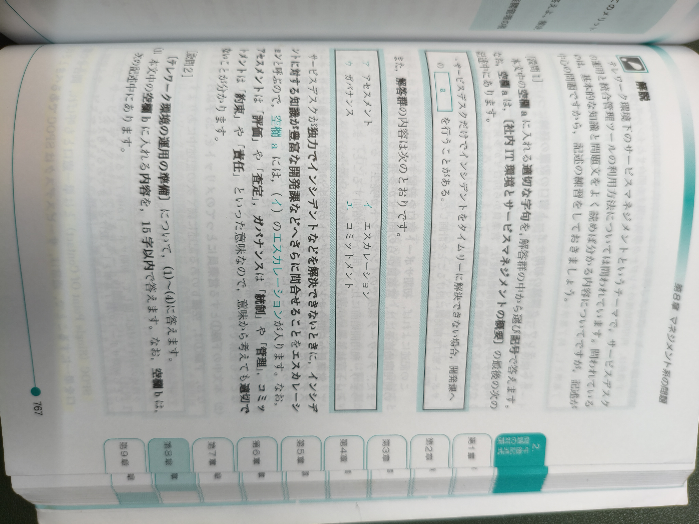
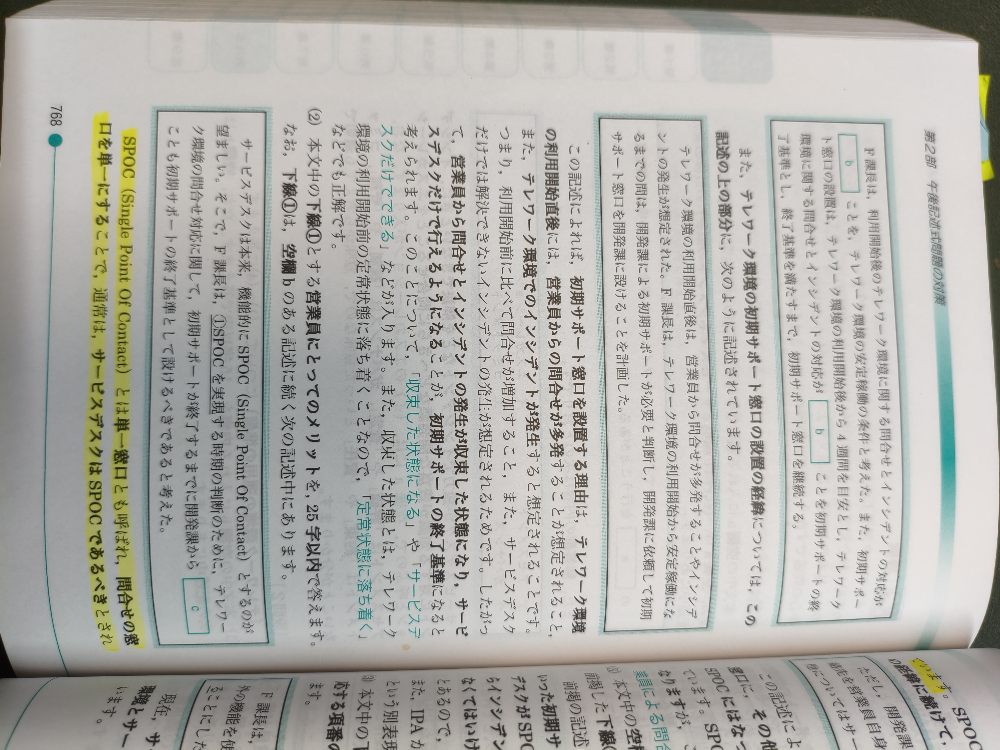
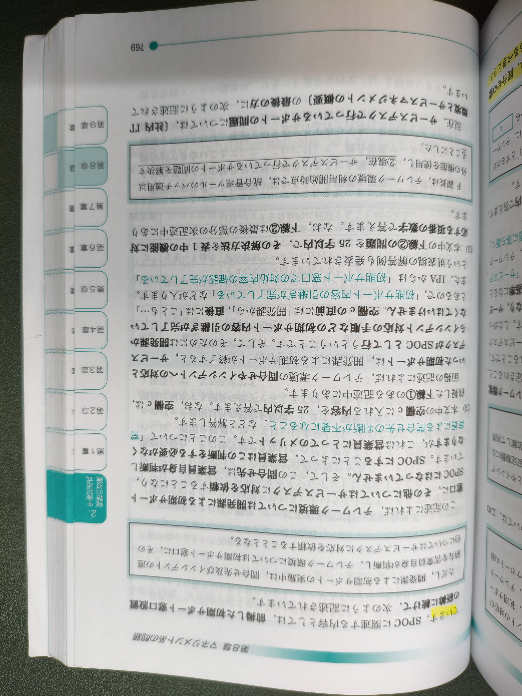
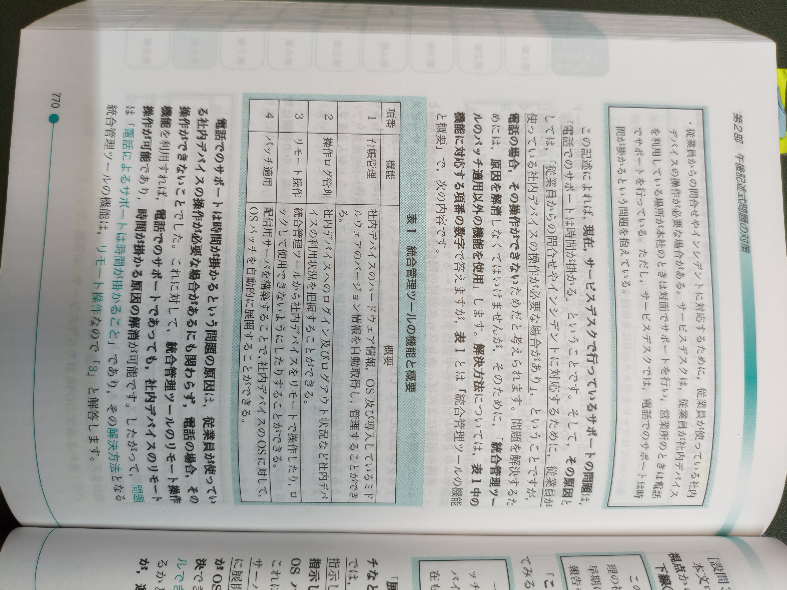
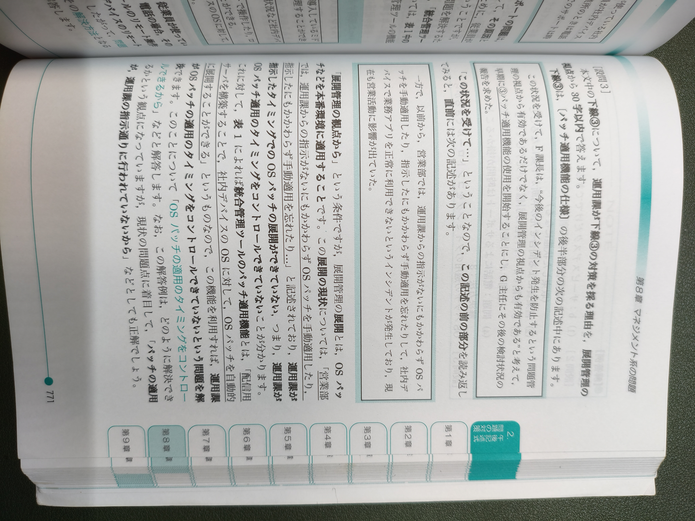
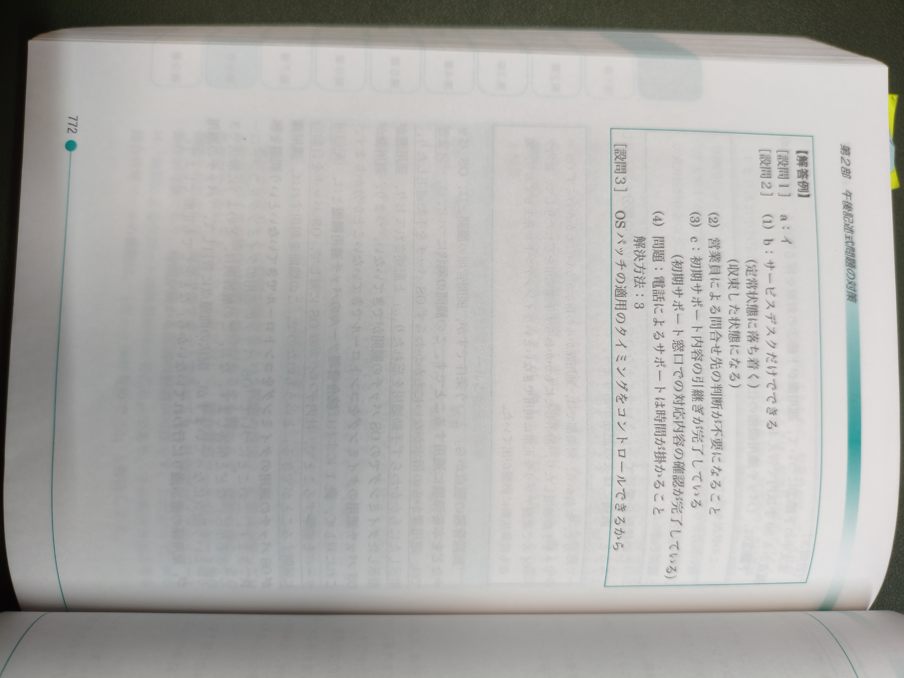
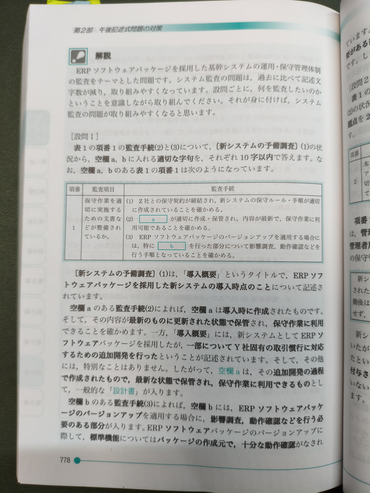
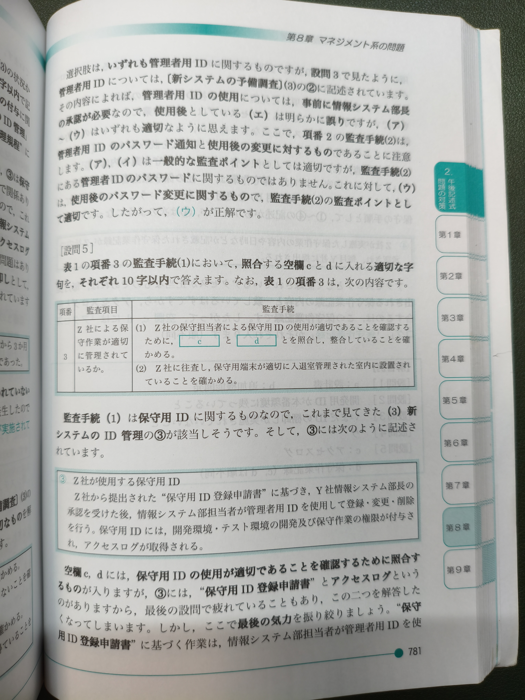
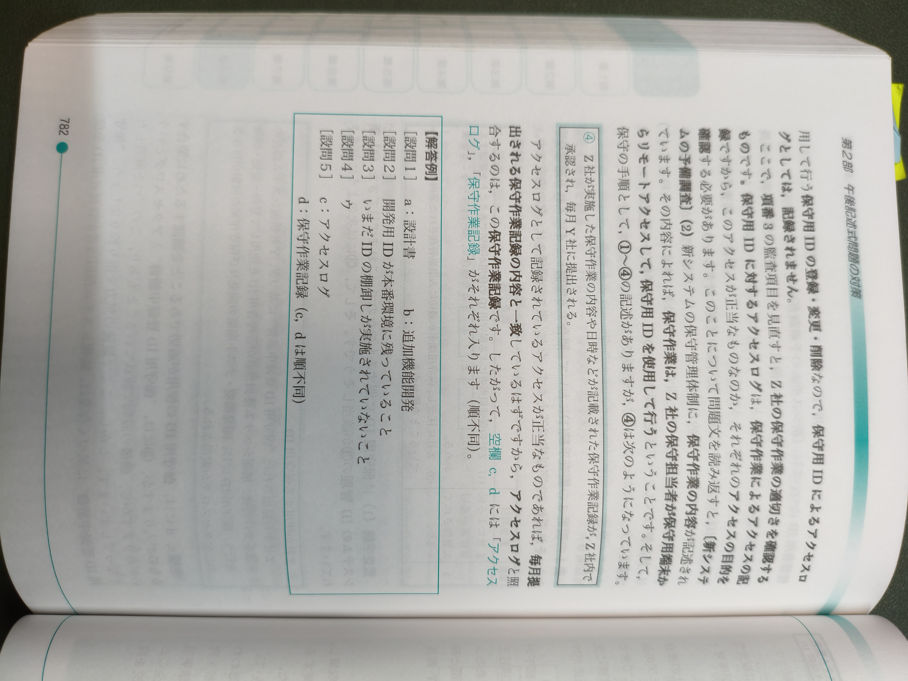

# 応用午後
## サービスマネジメント
### R6春期 問10
#### 問題
[R6春期 問10](https://www.ap-siken.com/kakomon/06_haru/pm10.html)
#### 回答

## システム監査
### 30秋期 問11
#### 問題
[30秋期 問11](https://www.ap-siken.com/kakomon/30_aki/pm11.html)
#### 回答

